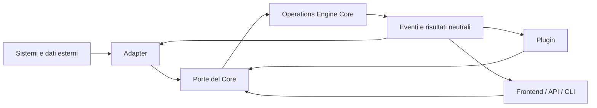
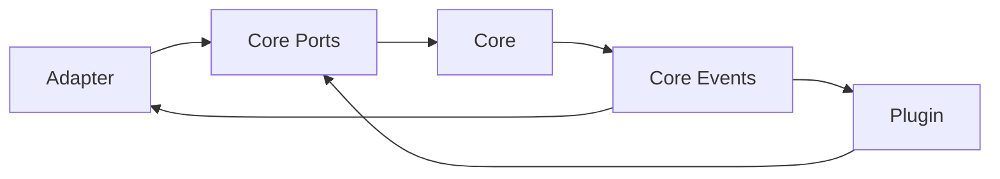

# Operations Engine

## Filosofia e Costituzione Architetturale

**Stato:** vincolante  
**Ambito:** intero progetto  
**Nome della piattaforma:** Operations Engine  
**Scopo:** stabilire i confini, le dipendenze e i criteri decisionali che ogni
evoluzione futura deve rispettare.

Questo documento non descrive una singola release. Definisce l'identità
tecnica del prodotto e prevale sulle convenienze locali di una funzionalità,
di un cliente o di un'integrazione.

Nel documento, i termini hanno questo significato:

- **DEVE** indica un requisito obbligatorio.
- **NON DEVE** indica un divieto architetturale.
- **DOVREBBE** indica la scelta predefinita, derogabile solo con motivazione.
- **PUÒ** indica un'opzione compatibile con la filosofia.

Una deroga a una regola espressa come DEVE o NON DEVE richiede una decisione
architetturale documentata, con motivazione, impatto, durata e piano di
rimozione. Una scorciatoia non documentata è una violazione.

---

## 1. Visione

### 1.1 Che cos'è Operations Engine

Operations Engine è un motore operativo configurabile che trasforma dati
eterogenei in uno stato operativo coerente, propone decisioni spiegabili e
governa l'esecuzione e le eccezioni di un'operazione.

Il suo ciclo fondamentale è:

1. acquisire dati da fonti interne o esterne;
2. tradurli in concetti neutrali del Core;
3. validare qualità, compatibilità e completezza;
4. calcolare conflitti, capacità e readiness;
5. generare o aggiornare un piano operativo;
6. proporre decisioni con motivazioni e alternative;
7. ricevere conferme o modifiche umane;
8. registrare eventi, versioni e conseguenze;
9. esporre lo stato risultante ai canali di utilizzo.

Operations Engine non possiede il processo reale dell'azienda. Lo rappresenta,
lo verifica e lo supporta attraverso configurazioni, regole e contratti
espliciti.

### 1.2 Che cosa non è

Operations Engine:

- non è un gestionale generalista;
- non è un ERP;
- non è un Fleet Manager;
- non è un TMS;
- non è un route optimizer;
- non è un sistema Amazon;
- non è un insieme di schermate collegate a un database;
- non è un contenitore di eccezioni costruite cliente per cliente;
- non è un chatbot;
- non è un sistema che sostituisce implicitamente il responsabile operativo.

Fleet, manutenzione, HR, finanza e analytics sono capacità estendibili. Non
definiscono l'identità del Core.

### 1.3 Proposta di valore

Il valore di Operations Engine è la capacità di applicare lo stesso modello
operativo a mercati, vettori e aziende differenti senza riscrivere il motore.

La piattaforma deve essere:

- **configurabile**, perché aziende diverse lavorano in modi diversi;
- **deterministica**, perché lo stesso input e la stessa configurazione devono
  produrre lo stesso risultato;
- **spiegabile**, perché ogni decisione deve indicare regole e dati utilizzati;
- **auditabile**, perché modifiche, eventi e versioni devono essere ricostruibili;
- **modulare**, perché una capacità deve poter evolvere senza contaminare le altre;
- **human-in-the-loop**, perché le decisioni distruttive o ambigue richiedono
  conferma esplicita;
- **indipendente dal mercato**, perché clienti e vettori sono integrazioni, non
  fondamenta.

### 1.4 Modello mentale

Operations Engine è composto da tre categorie nettamente separate:

1. **Core:** comprende i concetti e i comportamenti operativi universali.
2. **Adapter:** traducono sistemi, file e vocabolari esterni nel linguaggio del
   Core e viceversa.
3. **Plugin:** aggiungono capacità di prodotto usando i contratti del Core.



La direzione delle dipendenze è verso il Core. Il Core non dipende da Adapter,
Plugin, frontend, database o framework di trasporto.

---

## 2. Core

### 2.1 Responsabilità

Il Core rappresenta la verità operativa neutrale. Deve poter funzionare senza
conoscere il nome dell'azienda, del vettore, del cliente o del file sorgente.

Il Core comprende almeno questi concetti:

- **Actor:** soggetto umano o di sistema che compie un'azione.
- **Human Resource:** persona disponibile per un'operazione.
- **Driver:** ruolo operativo configurabile di una Human Resource, privo di
  semantiche legate a uno specifico vettore.
- **Asset:** bene fisico o digitale utilizzabile.
- **Resource:** capacità utilizzabile da un'operazione, umana o materiale.
- **Capability:** requisito o competenza posseduta da una Resource.
- **Task:** unità di lavoro richiesta.
- **Operation:** insieme coordinato di Task, Resource e vincoli in un periodo.
- **Operational Unit:** luogo o perimetro organizzativo neutrale.
- **Time Window:** intervallo entro cui un Task deve essere eseguito.
- **Event:** fatto osservato che può cambiare lo stato operativo.
- **Rule:** vincolo o criterio dichiarato e versionato.
- **Decision:** proposta o risultato prodotto applicando regole a dati noti.
- **Planning:** piano operativo versionato per una data e un perimetro.
- **Assignment:** relazione tra Task e Resource.
- **Conflict:** violazione, ambiguità o incompatibilità rilevata.
- **Capacity:** disponibilità confrontata con la domanda operativa.
- **Operational Readiness:** valutazione spiegabile della possibilità di eseguire
  un'operazione.
- **Alternative:** opzione non scelta con motivazione.
- **Configuration:** insieme versionato di policy e nomenclature applicabili.
- **Audit Record:** traccia di chi, quando e perché ha prodotto una modifica.

### 2.2 Invarianti universali

Il Core protegge invarianti che non dipendono dal workflow di un'azienda:

- identità stabili per entità ed eventi;
- assegnazioni coerenti con capacità e disponibilità dichiarate;
- assenza di duplicazioni incompatibili;
- versionamento delle modifiche operative;
- eventi applicati una sola volta o gestiti in modo idempotente;
- separazione tra simulazione e applicazione;
- tracciabilità della provenienza dei dati;
- distinzione tra dato osservato, dato configurato e dato derivato;
- decisioni automatiche accompagnate da motivazioni;
- nessuna invenzione silenziosa di dati mancanti;
- nessuna modifica distruttiva implicita.

Le invarianti non sono configurabili. Le policy aziendali lo sono. Per esempio,
"una Resource non può essere assegnata oltre la capacità consentita" è
un'invariante; il valore della capacità consentita è una configurazione.

### 2.3 Cosa il Core non deve conoscere

Il Core NON DEVE contenere riferimenti o ramificazioni dedicate a:

- Amazon;
- GLS;
- BRT;
- DHL;
- nomi di clienti o DSP;
- nomi di file proprietari;
- codici o colonne specifiche di un fornitore;
- termini contrattuali di un singolo mercato;
- endpoint o protocolli di una piattaforma esterna;
- logiche condizionali basate sull'identità dell'Adapter attivo.

Termini esterni devono essere tradotti prima di entrare nel Core. Esempi:

| Termine esterno | Concetto Core possibile |
| --- | --- |
| station | Operational Unit |
| route | Task o gruppo di Task |
| wave | Time Window o Work Batch |
| dispatch | transizione di stato dell'Operation |
| abort | evento di cancellazione del Task |
| yard | area o Resource Pool dell'Operational Unit |
| scorecard | insieme di Metric Observation |
| vehicle | Asset con capability configurate |

La tabella è una guida di modellazione, non un mapping universale. Il mapping
effettivo appartiene all'Adapter.

### 2.4 Decision Engine

Il Decision Engine è una capacità del Core, non un sinonimo di intelligenza
artificiale. Deve:

- ricevere fatti normalizzati, configurazione e regole versionate;
- produrre decisioni deterministiche;
- indicare regole applicate e regole non applicate;
- esporre confidenza solo quando ha un significato misurabile;
- distinguere errori bloccanti, warning e informazioni;
- restituire alternative ordinate;
- spiegare perché un'alternativa non è stata scelta;
- consentire simulazioni prive di effetti persistenti;
- non applicare automaticamente decisioni distruttive o cross-boundary.

Un futuro componente AI può proporre osservazioni o alternative, ma non può
rendere opaca una decisione del Core.

### 2.5 Linguaggio del dominio

Il codice del Core DEVE usare nomi neutrali. Le parole ereditate dall'attuale
verticale last-mile possono rimanere temporaneamente per compatibilità, ma non
devono diventare il modello definitivo.

La migrazione deve essere incrementale:

1. introdurre il concetto neutrale;
2. definire un mapping esplicito dal termine esistente;
3. mantenere compatibilità ai confini;
4. migrare i casi d'uso;
5. rimuovere il termine specifico dal Core solo quando test e contratti lo
   consentono.

Non è ammesso un rifacimento completo non verificabile.

---

## 3. Adapter

### 3.1 Definizione

Un Adapter è un livello anticorruzione tra Operations Engine e un mondo
esterno. Traduce formati, vocabolari, identificativi e semantiche esterne nei
contratti neutrali del Core.

Un Adapter può essere inbound, outbound o bidirezionale:

- **inbound:** importa dati ed eventi nel Core;
- **outbound:** esporta decisioni e stati verso un sistema esterno;
- **bidirezionale:** mantiene entrambe le traduzioni senza confondere i modelli.

### 3.2 Responsabilità di un Adapter

Un Adapter DEVE occuparsi di:

- alias e nomi di campo esterni;
- parsing di formati specifici;
- mapping di identificativi;
- conversione di stati e nomenclature;
- validazioni richieste dal contratto esterno;
- traduzione di eventi;
- gestione delle versioni del formato esterno;
- import ed export specifici;
- errori comprensibili legati alla fonte;
- metadati di provenienza;
- test di contratto con fixture prive di dati personali.

Un Adapter NON DEVE:

- implementare il motore di planning;
- decidere assegnazioni;
- calcolare readiness universale;
- accedere direttamente ai dettagli interni di un Plugin;
- modificare modelli Core per comodità locale;
- introdurre termini esterni nei servizi Core;
- duplicare regole già presenti nel Core.

### 3.3 Amazon Adapter

Amazon è il primo Adapter, non il prodotto.

L'Amazon Adapter può conoscere concetti come:

- abort;
- yard;
- scorecard;
- station;
- route;
- dispatch;
- wave;
- cycle;
- DSP;
- formati e alias dei file Amazon;
- codici evento o stato propri dell'ecosistema Amazon.

Il suo compito è trasformare tali concetti in Task, Event, Operational Unit,
Time Window, Metric Observation e altri concetti neutrali.

La presenza o l'assenza dell'Amazon Adapter non deve cambiare il comportamento
intrinseco del Core.

### 3.4 Adapter futuri

Devono poter esistere, senza modificare il Core:

- GLS Adapter;
- DHL Adapter;
- BRT Adapter;
- adapter per file Excel o CSV proprietari;
- adapter per sistemi ERP o TMS esterni;
- adapter per telematica o provider di dati;
- adapter manuale per inserimenti controllati.

Ogni nuovo Adapter deve implementare porte e contratti pubblici. Non deve
ottenere eccezioni nel Core.

### 3.5 Contratti e compatibilità

I contratti tra Adapter e Core devono essere:

- tipizzati;
- versionati;
- validati al confine;
- indipendenti dal protocollo;
- testabili senza avviare l'intera applicazione;
- compatibili in modo esplicito, mai per coincidenza.

Una modifica incompatibile richiede una nuova versione del contratto o una
migrazione dichiarata.

---

## 4. Plugin

### 4.1 Definizione

Un Plugin estende le capacità della piattaforma senza modificare l'identità del
Core. Possiede un perimetro funzionale chiaro e comunica con Operations Engine
esclusivamente attraverso porte, servizi applicativi ed eventi pubblici del
Core.

Esempi:

- Fleet Plugin;
- Finance Plugin;
- Maintenance Plugin;
- HR Plugin;
- Analytics Plugin;
- AI Plugin.

### 4.2 Differenza tra Adapter e Plugin

| Adapter | Plugin |
| --- | --- |
| collega un mondo esterno | aggiunge una capacità interna |
| traduce vocabolari e formati | implementa un dominio funzionale opzionale |
| protegge il Core da modelli esterni | usa i contratti del Core |
| può essere specifico di un vettore | deve restare indipendente dagli Adapter |
| non decide capacità di prodotto | può offrire nuovi casi d'uso |

Un Fleet Plugin gestisce il ciclo di vita degli Asset. Un Amazon Adapter
traduce il termine e lo stato di un mezzo Amazon in un Asset del Core. Sono
responsabilità diverse.

### 4.3 Regola di comunicazione

Ogni Plugin comunica con il Core. Un Plugin NON DEVE comunicare direttamente
con un Adapter.



Se un Plugin necessita di un dato proveniente da un Adapter, quel dato deve
prima essere tradotto e pubblicato come contratto o evento neutrale del Core.

### 4.4 Autonomia di un Plugin

Un Plugin:

- DEVE avere responsabilità e confini dichiarati;
- DEVE poter essere disabilitato senza rompere il Core;
- DEVE dipendere da interfacce pubbliche, non da implementazioni interne;
- DEVE possedere test propri;
- DEVE versionare i propri contratti;
- PUÒ avere persistenza e interfacce dedicate, isolate dal Core;
- PUÒ sottoscrivere eventi Core;
- PUÒ produrre fatti o proposte che il Core valida prima dell'uso;
- NON DEVE duplicare entità Core;
- NON DEVE imporre le proprie regole a chi non lo installa;
- NON DEVE diventare una cartella generica per codice non classificato.

### 4.5 Confini dei Plugin previsti

- **Fleet Plugin:** anagrafica e ciclo di vita Asset, disponibilità, documenti e
  dotazioni. Non decide il planning.
- **Maintenance Plugin:** interventi, scadenze e indisponibilità tecniche. Pubblica
  eventi e capacità aggiornate al Core.
- **HR Plugin:** anagrafica, qualifiche, disponibilità e vincoli delle Human
  Resource. Non assegna direttamente Task.
- **Finance Plugin:** costi, ricavi e impatti economici. Consuma risultati
  operativi, non altera fatti storici.
- **Analytics Plugin:** metriche, aggregazioni e trend. Non diventa fonte della
  verità operativa.
- **AI Plugin:** suggerimenti, classificazioni o previsioni dichiaratamente
  probabilistiche. Non sostituisce regole, audit e conferma umana.

---

## 5. Configurazione

### 5.1 Il software non impone workflow

Operations Engine fornisce primitive, invarianti e strumenti di decisione. Non
impone un unico modo di lavorare.

Ogni organizzazione deve poter configurare:

- workflow;
- regole;
- stati e transizioni;
- capacità;
- soglie;
- priorità;
- tipologie di Asset;
- tipologie di Human Resource e ruoli;
- tipologie di Task;
- capability richieste;
- calendari e finestre temporali;
- nomenclature visualizzate;
- livelli di severità;
- criteri di readiness;
- politiche di riserva;
- criteri di conferma manuale;
- policy cross-unit;
- formati di import ed export attraverso Adapter.

### 5.2 Configurazione dichiarativa

La configurazione DEVE essere dichiarativa, tipizzata, validata e versionata.
Non deve contenere codice arbitrario, `eval`, script non controllati o formule
eseguibili provenienti da file esterni.

Ogni configurazione deve indicare:

- identificativo e versione;
- ambito di applicazione;
- data di validità;
- autore o provenienza;
- valori predefiniti espliciti;
- regole di fallback;
- risultato della validazione;
- compatibilità con i contratti Core.

### 5.3 Gerarchia

Una futura gerarchia può prevedere:

1. default sicuri della piattaforma;
2. configurazione dell'organizzazione;
3. configurazione dell'Operational Unit;
4. configurazione dell'Operation;
5. override temporaneo esplicito e auditato.

Le precedenze devono essere deterministiche. Un override non deve cancellare
la provenienza del valore sostituito.

### 5.4 Invarianti e policy

La configurabilità non autorizza stati incoerenti.

- Le **invarianti** proteggono integrità, audit e consistenza e non possono
  essere disattivate.
- Le **policy** descrivono come l'azienda preferisce operare e sono configurabili.
- Le **nomenclature** cambiano il linguaggio mostrato, non il significato
  interno.
- Le **regole specifiche di mercato** appartengono agli Adapter.
- Le **capacità opzionali** appartengono ai Plugin.

### 5.5 Spiegabilità della configurazione

Ogni decisione deve poter rispondere a:

- quale configurazione è stata usata;
- quale versione era attiva;
- quale regola ha prodotto il risultato;
- quale valore derivava da default, organizzazione o override;
- quali alternative erano disponibili;
- perché una regola non è stata applicata.

---

## 6. Regole Architetturali Inviolabili

### 6.1 Dipendenze

La direzione consentita è:

```text
Interfaces -> Application -> Domain
Infrastructure -> Core Ports
Adapters -> Core Ports
Plugins -> Core Ports
Core -> nessuno dei livelli esterni
```

Sono vietate le seguenti dipendenze:

- Core verso Adapter;
- Core verso Plugin;
- Core verso frontend;
- Core verso framework web;
- Domain verso database;
- Plugin verso Adapter;
- Adapter verso implementazioni interne di un Plugin;
- frontend verso database;
- repository verso componenti UI.

### 6.2 Modularità

- Nessun file monolitico.
- Ogni modulo deve avere una responsabilità riconoscibile.
- Un servizio applicativo dovrebbe rappresentare un caso d'uso.
- Un repository deve occuparsi di persistenza, non di decisioni.
- Uno schema di trasporto non deve diventare automaticamente modello di dominio.
- Una utility deve essere realmente trasversale e priva di regole business.
- Una cartella `common`, `shared` o `utils` non deve diventare un deposito
  indiscriminato.
- Un'astrazione si introduce quando elimina dipendenze o duplicazioni reali.
- Non si anticipano framework e livelli privi di un caso d'uso concreto.

### 6.3 Dominio

- Il dominio deve usare nomi neutrali.
- Nessuna logica Amazon, GLS, BRT, DHL o cliente-specifica nel Core.
- Le regole di business non devono essere sparse in router, repository o frontend.
- Gli stati devono essere espliciti e le transizioni validate.
- Gli eventi applicati devono essere immutabili o corretti tramite nuovi eventi.
- Ogni dato derivato deve mantenere la provenienza.
- Le simulazioni non devono modificare lo stato reale.
- Le modifiche manuali devono registrare actor, timestamp e motivazione.
- Le decisioni automatiche devono essere deterministiche e spiegabili.

### 6.4 Frontend

- Nessuna logica business nel frontend.
- Il frontend presenta stato, raccoglie comandi e mostra spiegazioni.
- Le validazioni frontend migliorano l'esperienza ma non sostituiscono quelle Core.
- Il frontend non ricostruisce readiness, capacity o assegnazioni.
- Le interfacce devono essere minimali, operative e accessibili.
- Desktop, tablet e mobile sono modalità dello stesso prodotto, non implementazioni
  divergenti.
- Nessuna schermata deve dipendere dal vocabolario di un Adapter senza passare
  da una nomenclatura configurata.

### 6.5 Adapter e Plugin

- Ogni Adapter è separato e testabile.
- Ogni Plugin è indipendente dagli Adapter.
- Un Adapter non modifica il Core per soddisfare un singolo formato.
- Un Plugin non duplica modelli Core.
- I contratti pubblici sono piccoli, tipizzati e versionati.
- Le estensioni usano porte o eventi, non import circolari.
- La rimozione di un Adapter o Plugin non deve corrompere dati Core.

### 6.6 Dati e persistenza

- Il database è un dettaglio infrastrutturale.
- La persistenza non definisce il dominio.
- Nessun modello Core deve esistere solo perché esiste una tabella.
- Le migrazioni devono essere esplicite, reversibili quando realistico e testate.
- I dati importati devono conservare provenienza, mapping e versione.
- I segreti non devono essere salvati nel codice o nei file di configurazione
  versionati.
- I dati personali devono essere minimizzati e protetti.
- I file esterni non devono essere eseguiti o considerati attendibili.

### 6.7 Qualità

- Nessuna duplicazione intenzionale senza una motivazione documentata.
- Ogni regressione corretta richiede un test.
- I test di dominio non devono dipendere da HTTP o database reali.
- Adapter e Plugin richiedono test di contratto.
- I casi d'uso critici richiedono test end-to-end realistici.
- Le fixture non devono contenere dati personali reali.
- Nessuna funzionalità è completata senza verifica del percorso operativo.
- Warning, errori e limitazioni reali devono essere dichiarati.
- La compatibilità all'indietro è una decisione esplicita, non un effetto casuale.

### 6.8 Governance

Ogni nuova funzione deve rispondere, prima dell'implementazione, a queste
domande:

1. È una responsabilità Core, Adapter, Plugin, Interface o Infrastructure?
2. Quale concetto neutrale usa?
3. Quali invarianti protegge?
4. Quale configurazione introduce?
5. Quali contratti pubblici modifica?
6. Come viene spiegata e auditata?
7. Come viene testata senza dipendenze esterne?
8. Può essere rimossa senza rompere il Core?

Decisioni trasversali, nuove dipendenze o deroghe devono essere documentate con
un Architecture Decision Record. Le decisioni temporanee devono avere una
scadenza o una condizione di rimozione.

---

## 7. Roadmap Tecnica

La roadmap descrive una sequenza architetturale. Non autorizza a costruire una
fase senza criteri di ingresso e uscita verificabili.

### Fase 1 - Import

**Obiettivo:** acquisire dati eterogenei in modo sicuro.

- import Excel e CSV;
- mapping e alias;
- normalizzazione;
- preview;
- provenienza e qualità del dato;
- conflitti di base.

**Esito atteso:** dati esterni trasformati in record normalizzati senza
dipendere da un formato unico.

### Fase 2 - Operations Engine

**Obiettivo:** produrre uno stato operativo neutrale e spiegabile.

- Operational Status;
- summary;
- issue;
- capacity;
- readiness deterministica;
- dashboard operativa.

**Esito atteso:** il sistema distingue fatti, capacità, conflitti e livello di
prontezza.

### Fase 3 - Planning

**Obiettivo:** generare e governare assegnazioni operative.

- planning versionato;
- assignment;
- alternative;
- modifiche manuali;
- simulazioni;
- eventi applicati;
- ricalcolo;
- export.

**Esito atteso:** un responsabile può creare, correggere e verificare un piano
senza perdere audit e spiegabilità.

### Fase 4 - Architecture

**Obiettivo:** consolidare formalmente i confini descritti in questa
costituzione.

- vocabolario Core neutrale;
- porte applicative;
- contratti Adapter;
- contratti Plugin;
- dependency rules;
- ADR;
- strategia di migrazione incrementale;
- test automatici dei confini.

**Esito atteso:** Amazon opera esclusivamente come Adapter e nessun nuovo
sviluppo introduce dipendenze inverse.

### Fase 5 - Fleet Plugin

**Obiettivo:** gestire il ciclo di vita degli Asset senza trasformare il Core in
un Fleet Manager.

- anagrafica Asset;
- disponibilità;
- documenti e dotazioni;
- eventi di stato;
- integrazione con capacity tramite contratti Core.

**Esito atteso:** il Plugin può essere rimosso o sostituito senza alterare il
planning Core.

### Fase 6 - Maintenance Plugin

**Obiettivo:** gestire manutenzione e indisponibilità tecniche.

- interventi;
- scadenze;
- blocchi tecnici;
- storico;
- eventi di indisponibilità e ripristino.

**Esito atteso:** la manutenzione pubblica fatti al Core ma non decide
direttamente le assegnazioni.

### Fase 7 - HR Plugin

**Obiettivo:** rappresentare disponibilità e capability delle Human Resource.

- anagrafiche;
- ruoli;
- qualifiche;
- vincoli;
- disponibilità;
- eventi di assenza e ripristino.

**Esito atteso:** il Core riceve Resource e capability neutrali, non regole HR
specifiche.

### Fase 8 - Finance Plugin

**Obiettivo:** misurare l'impatto economico delle operazioni.

- costi;
- ricavi;
- budget;
- consuntivi;
- scenari economici;
- audit dei calcoli.

**Esito atteso:** la finanza consuma risultati operativi senza alterare la
verità storica del Core.

### Fase 9 - AI Operations

**Obiettivo:** aggiungere supporto probabilistico controllato.

- previsioni di rischio;
- suggerimenti;
- classificazione di anomalie;
- spiegazioni assistite;
- valutazione continua della qualità;
- approvazione umana.

**Prerequisiti obbligatori:** dati versionati, decisioni deterministiche,
baseline misurabili, audit e fallback non-AI.

**Esito atteso:** l'AI migliora la qualità delle proposte ma non diventa una
dipendenza necessaria del Core.

---

## 8. Albero Futuro

Questo albero rappresenta la direzione desiderata. Non richiede la creazione
immediata dei file e non autorizza una migrazione massiva.

```text
operations-engine/
  docs/
    architecture/
      OPERATIONS_ENGINE_PHILOSOPHY.md
      adr/
      contracts/

  backend/
    app/
      bootstrap/
        application.py
        dependency_container.py

      core/
        domain/
          actors/
          resources/
          assets/
          tasks/
          operations/
          planning/
          assignments/
          conflicts/
          capacity/
          readiness/
          decisions/
          events/
        application/
          commands/
          queries/
          services/
        ports/
          inbound/
          outbound/
          repositories/
          event_bus/
        policies/
          rules/
          validation/
          decision_engine/
        configuration/
          models/
          validation/
          resolution/

      adapters/
        amazon/
          inbound/
          outbound/
          mappings/
          vocabulary/
          contracts/
          fixtures/
        gls/
        dhl/
        brt/
        generic_files/

      plugins/
        fleet/
          domain/
          application/
          ports/
          infrastructure/
          interfaces/
        maintenance/
        hr/
        finance/
        analytics/
        ai_operations/

      infrastructure/
        persistence/
          database/
          repositories/
          migrations/
        files/
        messaging/
        observability/
        security/

      interfaces/
        api/
          routers/
          schemas/
          error_handlers/
        cli/
        jobs/

      shared/
        kernel/
        types/

    tests/
      unit/
      contract/
      integration/
      end_to_end/
      architecture/
      fixtures/

  frontend/
    index.html
    assets/
      css/
        base/
        layout/
        components/
        responsive/
      js/
        shell/
        api/
        state/
        modules/
          operations/
          planning/
          configuration/
        plugins/
          fleet/
          maintenance/
          hr/
          finance/
        components/
        utils/

  tools/
    validation/
    migrations/

  README.md
```

### 8.1 Criteri di evoluzione dell'albero

- Le directory nascono solo quando esiste una responsabilità concreta.
- I contratti vengono estratti prima di spostare implementazioni.
- I moduli esistenti vengono migrati per piccoli casi d'uso verificabili.
- Il legacy resta isolato finché non è rimosso con una decisione esplicita.
- Nessuna rinomina massiva deve interrompere API o dati senza una migrazione.
- I test di architettura devono impedire dipendenze vietate.
- La struttura fisica deve riflettere i confini logici, non sostituirli.

---

## 9. I 10 Principi di Operations Engine

1. **Il software non impone workflow.** Offre primitive, invarianti e
   configurazioni con cui ogni organizzazione rappresenta il proprio modo di
   operare.

2. **Il Core è indipendente dal mercato.** Non conosce vettori, clienti,
   formati proprietari o nomi specifici.

3. **Gli Adapter collegano il mondo esterno.** Traducono dati, eventi e
   vocabolari senza contaminare il Core.

4. **I Plugin estendono il Core.** Aggiungono capacità autonome e comunicano
   solo attraverso contratti ed eventi neutrali.

5. **Le decisioni sono spiegabili.** Ogni risultato automatico dichiara dati,
   regole, alternative, limiti e motivazioni.

6. **La configurazione governa le policy.** Workflow, stati, soglie,
   nomenclature e priorità non devono essere dispersi nel codice.

7. **Il frontend è minimale e operativo.** Presenta informazioni e raccoglie
   comandi, ma non contiene la verità o le regole business.

8. **La modularità viene prima della velocità locale.** Una consegna rapida non
   giustifica dipendenze inverse, duplicazioni o file monolitici.

9. **Ogni nuova funzione deve rispettare questa filosofia.** Deve dichiarare il
   proprio confine, i contratti, la configurazione, l'audit e i test.

10. **Questo documento è vincolante.** Operations Engine può evolvere, ma non
    può contraddire questi principi senza una decisione architetturale
    esplicita, documentata e verificabile.
