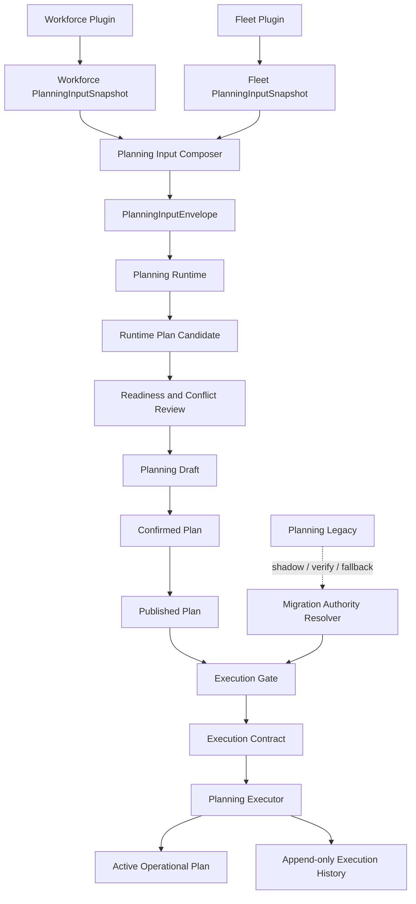
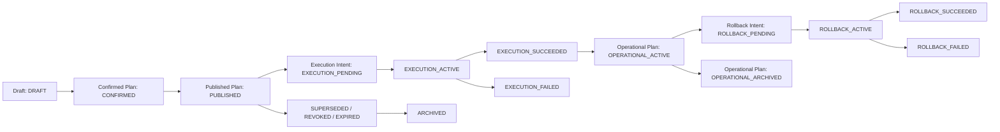
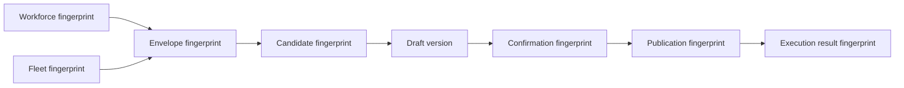

# Planning Runtime Migration Strategy

**Documento:** PW-9A-FIX

**Stato:** strategia corretta dopo Architecture Review

**Ambito:** migrazione controllata dal Planning legacy al Planning Runtime

**Natura:** documento architetturale, nessuna implementazione

**Data:** 23 luglio 2026

**Documenti vincolanti:** `OPERATIONS_ENGINE_PHILOSOPHY.md`, `OPERATIONS_ENGINE_VISION.md`, `OPERATIONS_ENGINE_ROADMAP.md`, `PLANNING_WORKSPACE_PRODUCT_CONTRACT.md`, `PLANNING_WORKSPACE_CONTRACT_INVENTORY.md`, `PLANNING_INPUT_ALIGNMENT.md`, `OPERATIONAL_UNIT_MODEL.md`, `CORE_ADAPTER_PLUGIN_BOUNDARIES.md`, `DEVELOPMENT_SPRINT_RULES.md`

---

## 1. Scopo e valore normativo

Questo documento definisce come Operations Engine passera dal Planning Engine legacy a un Planning Runtime autorevole senza interrompere l'operativita, duplicare esecuzioni o perdere tracciabilita.

PW-9A non modifica il sistema. Stabilisce i vincoli che le implementazioni PW-9 e PW-10 dovranno rispettare.

Nel documento:

- **DEVE** e **NON DEVE** indicano un requisito obbligatorio;
- **DOVREBBE** indica una scelta raccomandata, derogabile solo con una decisione architetturale registrata;
- **PUO** indica una possibilita compatibile con la strategia;
- **scope operativo** indica la quaterna `organization_id + operational_unit_id + planning_date + timezone`;
- **autorita operativa** indica l'unico componente autorizzato a rendere eseguibile un piano per uno scope operativo.

In caso di conflitto, prevalgono la Costituzione e i contratti di prodotto gia vincolanti.

---

## 2. Visione della migrazione

La migrazione non sostituisce un servizio con un altro in un solo rilascio. Costruisce una catena di fiducia progressiva:

```mermaid
flowchart LR
    Inputs["Planning Input"] --> Runtime["Planning Runtime"]
    Runtime --> Readiness["Readiness"]
    Readiness --> Conflicts["Conflict Review"]
    Conflicts --> Timeline["Timeline"]
    Timeline --> Draft["Draft"]
    Draft --> Confirmation["Confirmation"]
    Confirmation --> Publication["Publication"]
    Publication --> Gate["Execution Gate - PW-9"]
    Gate --> Execution["Operational Execution"]
```



La catena fino a Publication esiste gia. Publication rende il piano ufficiale e immutabile, ma **non lo rende ancora eseguibile**. PW-9 introdurra un confine di esecuzione separato. Questo confine sara l'unico punto in cui una versione pubblicata puo diventare operativa.

La migrazione deve mantenere sempre queste proprieta:

1. una sola autorita di esecuzione per scope operativo;
2. nessuna modifica silenziosa a Draft, Confirmed Plan o Published Plan;
3. ogni esecuzione riferita a una versione e a un fingerprint immutabili;
4. rollback esplicito e auditabile;
5. nessuna dipendenza del Core da Plugin, Adapter o import Excel;
6. nessuna logica di dominio nel Workspace;
7. nessuna doppia esecuzione durante shadow, confronto o fallback.

---

## 3. Obiettivi

La strategia ha sette obiettivi:

1. mantenere il Planning legacy come fonte operativa finche il Runtime non e misurato e approvato;
2. permettere al Runtime di osservare e poi generare senza produrre effetti operativi prematuri;
3. rendere esplicita la fonte di verita in ogni fase e per ogni tipo di dato;
4. introdurre un Execution Contract stabile tra Published Plan ed esecuzione;
5. garantire scope, versioni, fingerprint, lock e idempotenza;
6. consentire rollback rapido senza perdita di storia;
7. rimuovere il legacy soltanto dopo evidenze tecniche e operative misurabili.

### 3.1 Non obiettivi

PW-9A non definisce:

- nuovi algoritmi di assegnazione;
- un Decision Engine;
- modifiche a Workforce o Fleet;
- automazioni Adapter-specifiche;
- un modello di esecuzione esterna verso sistemi terzi;
- nuove schermate o endpoint;
- dettagli fisici di schema database;
- la rimozione immediata del Planning legacy.

---

## 4. Baseline reale al termine di PW-8

La strategia parte dai contratti realmente presenti, non da un'architettura ipotetica.

| Area | Stato attuale verificato | Conseguenza per PW-9 |
|---|---|---|
| Planning Input | Snapshot Workforce e Fleet tipizzati, scoped, versionati, con freshness e validazione | Ingresso neutrale gia disponibile |
| Runtime Composition | Compone l'envelope solo quando i contratti sono compatibili e `READY` | Puo alimentare il futuro generatore |
| Legacy flag | Il report Runtime dichiara `legacy_flow_active=true` | Il passaggio di autorita non e ancora avvenuto |
| Readiness | Legata a envelope version/fingerprint, OU e data | Gate disponibile, da ricontrollare prima dell'esecuzione |
| Conflict Review | Deriva dallo stesso contesto Runtime/Readiness | Non deve diventare un secondo motore di decisione |
| Timeline | Ricostruisce eventi del percorso Planning | Deve ricevere eventi di migrazione ed esecuzione in futuro |
| Draft | Separato, versionato, modificabile solo nei metadati previsti | Non e fonte operativa |
| Confirmation | Immutabile, scoped e legata a Draft/envelope/readiness | Attesta una decisione umana su una versione |
| Publication | Immutabile, scoped, fingerprinted e unica nel contesto corrente | E un prerequisito, non un comando di esecuzione |
| Publication service | Dichiara esplicitamente che nessuna esecuzione viene avviata | Serve un Execution Gate separato |
| Planning legacy | Genera, ricalcola, modifica assegnazioni, simula/applica eventi ed espone latest/history/export | Resta oggi l'unica fonte operativa |
| Decision Engine | Non presente come autorita autonoma | Resta fuori da PW-9 |

### 4.1 Limiti attuali rilevanti

- Il Runtime attuale compone e valuta input, ma non contiene ancora un generatore operativo sostitutivo.
- Il Published Plan non trasporta ancora un payload eseguibile completo e autonomo.
- Publication permette oggi una sola pubblicazione per scope; la futura semantica di supersession richiede una decisione esplicita.
- Non esiste ancora un'autorita di migrazione persistita per organizzazione, Operational Unit e data.
- Non esiste ancora un lock distribuito dedicato all'esecuzione Planning.
- Il Planning legacy utilizza ancora modelli e servizi propri, inclusi termini verticali storici.

Questi limiti non sono corretti in PW-9A. Diventano gate della roadmap.

---

## 5. Perche non adottare un Big Bang

Un passaggio diretto dal legacy al Runtime non e accettabile per cinque ragioni.

### 5.1 Assenza di evidenza comparativa

Il Runtime non ha ancora prodotto risultati confrontabili su un campione operativo sufficiente. Sostituire il legacy prima della fase shadow impedirebbe di distinguere errori nuovi da differenze intenzionali.

### 5.2 Contratto di esecuzione ancora assente

Publication prova che un piano e stato confermato e pubblicato. Non definisce ancora come l'esecuzione viene avviata, resa idempotente, bloccata, ripresa o annullata.

### 5.3 Rischio di doppia autorita

Senza un'autorita risolta per scope, legacy e Runtime potrebbero entrambi modificare lo stato operativo. Il risultato sarebbe non deterministico e difficilmente reversibile.

### 5.4 Rollback non dimostrato

Un Big Bang rende il rollback un ritorno di versione applicativa. La strategia richiede invece un rollback di autorita controllato, per scope, senza cancellare Published Plan o storia di esecuzione.

### 5.5 Osservabilita insufficiente

Prima del cutover servono metriche di parita, stabilita, latenza, idempotenza e recovery. Senza baseline, una migrazione apparentemente riuscita puo nascondere errori operativi.

---

## 6. Architettura target



### 6.1 Confini

- Workforce e Fleet restano proprietari dei propri dati.
- Planning Input traduce i contratti pubblici in un envelope Core.
- Planning Runtime genera una proposta; non legge repository Plugin direttamente.
- Readiness e Conflict Review spiegano la qualita del contesto; non eseguono.
- Confirmation registra l'approvazione umana.
- Publication registra la versione ufficiale da distribuire.
- Execution Gate verifica se quella Publication puo diventare operativa.
- Planning Executor applica esclusivamente un Execution Contract accettato.
- Workspace osserva e invia comandi; non ricostruisce regole o autorita.
- Adapter e Plugin non vengono chiamati direttamente dal dominio Planning.

### 6.2 Un solo writer operativo

Per ogni scope operativo deve valere:

> In ogni istante esiste al massimo una autorita autorizzata a creare o modificare lo stato operativo del Planning.

Shadowing, confronto e verifica possono eseguire calcoli paralleli, ma i risultati non autorevoli sono read-only e non producono side effect.

---

## 7. Ruoli dei componenti

### 7.1 Planning Legacy

Durante la migrazione il legacy ha tre ruoli, mai contemporaneamente per lo stesso scope:

- **autorita operativa** nelle Fasi 0, 1 e 2;
- **fallback disattivato** nella Fase 3, attivabile solo da rollback esplicito;
- **disabilitato ma deployabile** nella Fase 4A;
- **escluso dal runtime attivo ma recuperabile da release conservata** nella Fase 4B;
- **eliminato** nella Fase 4C.

Il legacy non deve leggere o modificare internamente Published Plan. L'integrazione deve avvenire attraverso boundary espliciti.

### 7.2 Planning Runtime

Il Runtime:

- consuma PlanningInputEnvelope;
- produce risultati deterministici e versionati;
- espone diagnostica e compatibilita;
- non accede direttamente a repository Workforce o Fleet;
- non diventa autorita per il solo fatto di aver generato un candidato;
- diventa autorita solo quando la fase di migrazione e l'Execution Gate lo consentono.

### 7.3 Published Plan

Il Published Plan:

- e una versione ufficiale, immutabile e scoped;
- conserva identita, versione, fingerprint, actor e timestamp;
- riferisce un Confirmed Plan immutabile;
- non equivale a esecuzione;
- non viene sovrascritto;
- puo essere rifiutato dall'Execution Gate se non e piu eleggibile.

### 7.4 Planning Workspace

Il Workspace:

- mostra stato, provenienza e motivo dei blocchi;
- richiede azioni esplicite per conferma, pubblicazione ed esecuzione;
- non decide quale motore sia autorevole;
- non confronta algoritmi;
- non calcola fingerprint;
- non implementa retry applicativi nascosti;
- non trasforma un placeholder o uno stato legacy in una prova di readiness.

---

## 8. Fonti di verita

La frase "fonte di verita" viene separata per evitare ambiguita.

| Dimensione | Fonte autorevole |
|---|---|
| Persone, turni, availability Workforce | Workforce Plugin, tramite contratto pubblico |
| Asset e availability Fleet | Fleet Plugin, tramite contratto pubblico |
| Configurazione risolta | Configuration Engine |
| Input usati dal Runtime | PlanningInputEnvelope identificato da version/fingerprint |
| Approvazione umana | Confirmed Plan |
| Versione ufficiale distribuita | Published Plan |
| Motore autorizzato a eseguire | Migration Authority per scope |
| Piano attivo | Execution Contract accettato e relativo stato di esecuzione |
| Audit | Registri append-only di Confirmation, Publication, Authority ed Execution |

Nessun singolo oggetto sostituisce tutte queste fonti. In particolare, Published Plan e Active Operational Plan non sono sinonimi.

### 8.1 Fonte di verita per fase

| Fase | Generazione candidata | Piano operativo/esecuzione | Publication | Legacy |
|---|---|---|---|---|
| 0 - Legacy unico | Legacy | Legacy | Informativa, non eseguibile | Autorita unica |
| 1 - Runtime osserva | Legacy; Runtime produce solo diagnostica/shadow | Legacy | Informativa, non eseguibile | Autorita unica |
| 2 - Runtime genera, Legacy verifica | Runtime produce candidato; Legacy produce verifica comparativa | Legacy fino a cutover | Riferimento del candidato approvato, non ancora eseguibile dal Runtime | Autorita operativa e verificatore |
| 3 - Runtime esegue | Runtime | Runtime | Sorgente obbligatoria dell'Execution Contract | Fallback spento |
| 4A - Legacy disabilitato | Runtime | Runtime | Sorgente obbligatoria dell'Execution Contract | Deployabile solo per rollback approvato |
| 4B - Legacy fuori dal runtime | Runtime | Runtime | Sorgente obbligatoria dell'Execution Contract | Solo release conservata |
| 4C - Legacy eliminato | Runtime | Runtime | Sorgente obbligatoria dell'Execution Contract | Assente, rollback legacy impossibile |

---

## 9. Identita dello scope operativo

La chiave minima di ogni comando, lock, confronto, metrica e audit e:

| Campo | Regola |
|---|---|
| Organization | Identificatore stabile e obbligatorio |
| Operational Unit | Identificatore Core stabile; mai la label e mai `Tutte` |
| Planning date | Data operativa locale, non data di creazione del record |
| Timezone | Identificatore IANA immutabile per la catena operativa, per esempio `Europe/Rome` |

La vista `Tutte` resta aggregazione di lettura. Non puo generare, confermare, pubblicare, eseguire o ottenere un lock.

Una modifica di organization, Operational Unit, planning date o timezone produce un nuovo scope. Non e consentito correggere lo scope mutando un oggetto gia confermato, pubblicato o eseguito.

L'identita tenant e composta da organization e grants dell'actor. Un `operational_unit_id` e univoco almeno dentro l'organizzazione; non viene mai risolto senza organization. Due organizzazioni possono usare lo stesso identificatore locale senza condividere dati, lock, audit o autorita.

---

## 10. Published Plan Contract

### 10.1 Contratto disponibile oggi

Il contratto esistente conserva gia:

- `publication_id`;
- organization, Operational Unit e planning date;
- stato `PUBLISHED`;
- versione Publication;
- identificatore, versione e fingerprint della Confirmation;
- fingerprint della Publication;
- actor;
- timestamp di pubblicazione;
- risultato di validazione.

Il fingerprint attuale include scope, versione Publication e identita/versione/fingerprint del Confirmed Plan tramite serializzazione canonica e SHA-256.

### 10.2 Requisiti prima dell'esecuzione

Per essere sorgente di un Execution Contract, un Published Plan DEVE inoltre rendere risolvibili, direttamente o tramite riferimenti immutabili:

- il payload operativo completo;
- la versione del PlanningInputEnvelope;
- il fingerprint dell'envelope;
- la versione delle regole Runtime applicate;
- la versione della configurazione risolta;
- la provenance del generatore;
- l'eventuale relazione di supersession con una Publication precedente.

Questi requisiti non vengono implementati in PW-9A. La loro forma persistente deve essere definita in PW-9 prima di attivare la Fase 2.

### 10.3 Immutabilita

Un Published Plan non viene aggiornato per diventare eseguibile. L'eleggibilita e una valutazione separata e timestamped. Una correzione produce una nuova catena Draft -> Confirmation -> Publication.

### 10.4 Lifecycle del Published Plan

Il record di Publication e immutabile. Il suo stato di lifecycle viene ricostruito da transizioni append-only; non viene ottenuto sovrascrivendo il payload pubblicato.

| Stato | Significato | Eseguibile |
|---|---|---:|
| `PUBLISHED` | Publication corrente e candidata all'Execution Gate | Si, se tutti i gate passano |
| `SUPERSEDED` | Una Publication correttiva piu recente e diventata corrente | No per nuovi intent |
| `REVOKED` | Un actor autorizzato ha revocato l'eleggibilita | No |
| `EXPIRED` | La finestra temporale configurata e terminata | No |
| `ARCHIVED` | Retention operativa conclusa; resta consultabile secondo policy | No |

Regole obbligatorie:

1. per ogni scope esiste al massimo una Publication nello stato `PUBLISHED` corrente;
2. possono esistere piu Publication storiche `SUPERSEDED`, `REVOKED`, `EXPIRED` o `ARCHIVED`;
3. nessuna Publication viene cancellata o sovrascritta;
4. una nuova Publication correttiva dichiara `supersedes_publication_id` e mantiene la catena causale;
5. supersession e revoca richiedono expected version, actor autorizzato, authority decision e audit;
6. una Publication che ha prodotto un Operational Plan non puo essere cancellata e resta referenziabile per sempre secondo retention;
7. `SUPERSEDED`, `REVOKED`, `EXPIRED` e `ARCHIVED` sono terminali rispetto a nuovi Execution Intent;
8. archiviazione non distrugge fingerprint, riferimenti, audit o outcome di esecuzione.

### 10.5 Publication eseguita e correzione successiva

Quando viene pubblicata una correzione:

- la Publication precedente passa a `SUPERSEDED`;
- il relativo Operational Plan, se attivo, **resta attivo** fino al successo dell'esecuzione della nuova Publication o di un rollback esplicito;
- la nuova Publication diventa corrente ma non operativa per il solo fatto di essere pubblicata;
- se la nuova esecuzione fallisce, il piano operativo precedente resta la fonte operativa e lo scope entra in attenzione;
- nessun tentativo puo rieseguire la Publication superseded;
- una revoca di una Publication gia eseguita blocca nuovi comandi sullo scope e richiede reconciliation o rollback; non annulla retroattivamente gli effetti.

Questa separazione consente che "Publication corrente" e "Operational Plan attivo" siano temporaneamente diversi senza creare due writer.

---

## 11. Execution Contract

L'Execution Contract e il confine tra "piano ufficiale" e "piano operativo". E composto da un **Execution Intent immutabile**, da uno o piu **Execution Attempt append-only** e da una proiezione di stato derivata. Deve essere neutrale, serializzabile e indipendente da UI, Plugin e Adapter.

### 11.1 Identita minima

| Gruppo | Informazioni obbligatorie |
|---|---|
| Intent | execution intent id, contract version, intent key, mode |
| Scope | organization id, Operational Unit id, planning date, IANA timezone |
| Publication | publication id, version, fingerprint |
| Confirmation | confirmation id, version, fingerprint |
| Input | envelope id, version, fingerprint |
| Runtime | Runtime release, rules version, configuration version |
| Autorita | migration phase, authority mode, authority decision id, fencing token |
| Comando | idempotency key, payload fingerprint, correlation id, causation id, authenticated actor |
| Tempo | requested at e accepted at sull'Intent; started at e finished at sugli Attempt |
| Risultato | attempt id, result fingerprint, outcome, error code sanitizzato |

### 11.2 Invarianti

1. Lo scope dell'Execution Contract coincide con Publication, Confirmation ed envelope.
2. Il fingerprint della Publication viene ricalcolato e verificato prima dell'accettazione.
3. La stessa Publication in modalita `EXECUTE` puo produrre un solo Execution Intent operativo.
4. Un Execution Intent puo produrre piu Attempt solo come retry o recovery dello stesso intento; al massimo un Attempt puo risultare `ATTEMPT_SUCCEEDED`.
5. Nessuna esecuzione puo iniziare senza autorita Runtime per quello scope.
6. Intent e Attempt accettati non vengono mutati; le transizioni generano record/eventi append-only e una proiezione ricostruibile.
7. Nessuna risposta tardiva puo sostituire un'esecuzione piu recente.
8. Il risultato deve essere correlabile al Published Plan originale.
9. Ogni Attempt porta lo stesso authority decision id dell'Intent e un fencing token uguale o superiore, mai inferiore.
10. Un Intent `EXECUTION_SUCCEEDED` e terminale e non puo essere riaperto.

### 11.3 Modalita

| Mode | Side effect operativo | Uso |
|---|---:|---|
| `SHADOW` | No | Fase 1, diagnostica e misure |
| `VERIFY` | No | Fase 2, confronto Runtime/legacy |
| `EXECUTE` | Si | Fasi 3 e 4 |
| `FALLBACK` | Si, solo legacy | Rollback esplicito in Fase 3 |

`SHADOW` e `VERIFY` non possono scrivere tabelle o proiezioni operative. Possono scrivere esclusivamente audit e metriche tecniche prive di dati personali non necessari.

### 11.4 Execution Intent immutabile

L'Execution Intent rappresenta una sola intenzione semantica di rendere operativa una Publication.

Identita minima:

- organization id;
- Operational Unit id;
- planning date;
- timezone;
- publication id e version;
- execution mode;
- intent key;
- authority decision id e fencing token;
- authenticated actor;
- payload fingerprint;
- requested at.

Per `EXECUTE`, l'intent key e la rappresentazione SHA-256 canonica e versionata di:

```text
execution-intent:v1
+ organization_id
+ operational_unit_id
+ planning_date
+ timezone
+ publication_id
+ publication_version
+ execution_mode
```

Lo stesso contenuto produce lo stesso intent key. Lo stesso intent key con un payload fingerprint differente viene rifiutato come conflitto di integrita.

### 11.5 Unicita e deduplicazione

I vincoli concettuali minimi sono:

| Vincolo | Effetto |
|---|---|
| Intent key globalmente unico dentro il tenant | Deduplica la stessa intenzione |
| Unico `EXECUTE` per publication id + version + scope | Impedisce una seconda esecuzione operativa, anche dopo il successo |
| Un solo Attempt attivo per Intent | Impedisce retry paralleli |
| Un solo Attempt riuscito per Intent | Impedisce doppio commit operativo |
| Un solo Operational Plan attivo per scope | Mantiene la single source of truth |
| Un solo Rollback Intent aperto per Operational Plan | Impedisce rollback concorrenti |

La regola non e piu "una sola esecuzione attiva": e **una sola intenzione operativa e un solo successo per Publication**.

### 11.6 Retry, nuovo intent e nuova Publication

- **Retry dello stesso intent:** stesso intent key e stessa idempotency key; genera o riprende un Attempt dello stesso Intent.
- **Nuovo intent:** consentito per la stessa Publication solo nelle modalita non operative `SHADOW` o `VERIFY`, con evaluation id distinto; non e consentito un secondo `EXECUTE`.
- **Nuova Publication:** genera un nuovo intent key e puo produrre un nuovo Operational Plan.
- **Supersession:** impedisce nuovi Intent sulla Publication precedente ma non modifica l'Intent gia riuscito.
- **Rollback:** usa un Rollback Intent distinto e non modifica l'Execution Intent originale.

---

## 12. State machine globale

Non esiste un singolo campo di stato condiviso da tutta la catena. Ogni aggregato ha una state machine indipendente, collegata da riferimenti immutabili. Lo stato globale viene derivato, non scritto manualmente.



### 12.1 Aggregati e stati

| Aggregato | Stati ammessi | Stato terminale |
|---|---|---|
| Planning Draft | `DRAFT` | confluisce in un record `CONFIRMED`, senza mutare la storia Draft |
| Confirmed Plan | `CONFIRMED` | immutabile; puo essere referenziato da Publication |
| Published Plan | `PUBLISHED`, `SUPERSEDED`, `REVOKED`, `EXPIRED`, `ARCHIVED` | `ARCHIVED` |
| Execution Intent | `EXECUTION_PENDING`, `EXECUTION_ACTIVE`, `EXECUTION_SUCCEEDED`, `EXECUTION_FAILED` | `EXECUTION_SUCCEEDED` o `EXECUTION_FAILED`; i recovery Attempt avvengono mentre l'Intent resta `EXECUTION_ACTIVE` |
| Execution Attempt | `ATTEMPT_PENDING`, `ATTEMPT_ACTIVE`, `ATTEMPT_SUCCEEDED`, `ATTEMPT_FAILED` | `ATTEMPT_SUCCEEDED` o `ATTEMPT_FAILED` |
| Operational Plan | `OPERATIONAL_INACTIVE`, `OPERATIONAL_ACTIVE`, `OPERATIONAL_SUPERSEDED`, `OPERATIONAL_REVOKED`, `OPERATIONAL_ARCHIVED` | `OPERATIONAL_ARCHIVED` |
| Rollback Intent | `ROLLBACK_PENDING`, `ROLLBACK_ACTIVE`, `ROLLBACK_SUCCEEDED`, `ROLLBACK_FAILED` | `ROLLBACK_SUCCEEDED` o `ROLLBACK_FAILED` |
| Rollback Attempt | `ROLLBACK_ATTEMPT_PENDING`, `ROLLBACK_ATTEMPT_ACTIVE`, `ROLLBACK_ATTEMPT_SUCCEEDED`, `ROLLBACK_ATTEMPT_FAILED` | successo o fallimento |

`COMPLETED` non e uno stato ammesso: confonde il completamento del comando con il ciclo di vita del piano.

Nel linguaggio globale, **Executed** significa la congiunzione verificabile `Execution Intent = EXECUTION_SUCCEEDED` e `Operational Plan = OPERATIONAL_ACTIVE`. **Archived** significa che Published Plan e Operational Plan hanno raggiunto i rispettivi stati di archivio senza operazioni aperte.

### 12.2 Transizioni Draft, Confirmation e Publication

| Da | A | Actor autorizzato | Precondizioni | Effetto e stato risultante | Idempotenza |
|---|---|---|---|---|---|
| nessun Draft | `DRAFT` | Planner | scope valido, expected absence | nuovo Draft versionato | stessa create key restituisce lo stesso Draft |
| `DRAFT` | nuova versione `DRAFT` | Planner | expected Draft version | append di nuova versione | stessa update key restituisce la stessa versione |
| `DRAFT` | `CONFIRMED` | Approver | Draft salvato, readiness valida, nessun blocker, separation of duties | nuovo Confirmed Plan immutabile | chiave deterministica su scope + Draft id/version + envelope fingerprint |
| `CONFIRMED` | `PUBLISHED` | Publisher | Confirmation valida, expected version, nessuna Publication concorrente | nuova Publication corrente | chiave deterministica su scope + Confirmation id/version |
| `PUBLISHED` | `SUPERSEDED` | Publisher | nuova Publication correttiva valida e riferimento causale | vecchia Publication storica; nuova corrente | retry restituisce la stessa coppia di transizioni |
| `PUBLISHED` | `REVOKED` | Publisher o Administrator secondo policy | expected version, motivazione, nessun rollback concorrente | blocco nuovi Intent; audit obbligatorio | chiave scope + publication + revocation reason/version |
| `PUBLISHED` | `EXPIRED` | policy temporale Core | finestra scaduta valutata con timezone dello scope | blocco nuovi Intent | stessa valutazione non duplica l'evento |
| `SUPERSEDED/REVOKED/EXPIRED` | `ARCHIVED` | Administrator/retention policy | nessuna operazione aperta, retention soddisfatta | stato storico archiviato | stessa archive key restituisce lo stesso esito |

### 12.3 Transizioni Execution Intent e Attempt

| Da | A | Actor autorizzato | Precondizioni | Effetto e stato risultante | Idempotenza |
|---|---|---|---|---|---|
| nessun Intent | `EXECUTION_PENDING` | Operator | Publication `PUBLISHED`, authority Runtime valida, intent key unico | Intent immutabile, nessun effetto operativo | stessa key restituisce l'Intent esistente |
| `EXECUTION_PENDING` | `EXECUTION_ACTIVE` | Planning Executor per conto dell'Operator | lock e fencing validi, gate ripetuto dentro transazione | primo Attempt `ATTEMPT_ACTIVE` | retry in corso restituisce stato attuale |
| `EXECUTION_ACTIVE` | `EXECUTION_SUCCEEDED` | Planning Executor | un solo Attempt riuscito, effetto e audit/outbox persistiti | nuovo `OPERATIONAL_ACTIVE`; precedente piano passa a `OPERATIONAL_SUPERSEDED` solo in modo atomico | retry restituisce stesso risultato |
| `EXECUTION_ACTIVE` | `EXECUTION_FAILED` | Planning Executor/recovery controller | Attempt fallito senza risultato operativo oppure recovery concluso | nessun nuovo piano attivo; il precedente resta invariato | retry del comando restituisce failure terminale o stato recovery |
| `ATTEMPT_FAILED` | nuovo `ATTEMPT_PENDING` | recovery controller | errore retryable, stesso Intent, nessun successo precedente, fencing corrente | nuovo Attempt append-only | stessa retry key non duplica Attempt |
| `ATTEMPT_PENDING` | `ATTEMPT_ACTIVE` | Planning Executor | lock acquisito | nessun cambio del piano attivo | deduplicato per attempt id |
| `ATTEMPT_ACTIVE` | `ATTEMPT_SUCCEEDED/FAILED` | Planning Executor | outcome riconciliato | evento terminale Attempt | terminale e immutabile |

### 12.4 Transizioni Operational Plan

| Da | A | Actor autorizzato | Precondizioni | Effetto |
|---|---|---|---|---|
| `OPERATIONAL_INACTIVE` | `OPERATIONAL_ACTIVE` | Planning Executor | Execution Intent riuscito e fencing corrente | diventa unica fonte operativa dello scope |
| `OPERATIONAL_ACTIVE` | `OPERATIONAL_SUPERSEDED` | Planning Executor | nuova Publication eseguita con successo nello stesso lock | nuovo piano diventa attivo; vecchio resta storico |
| `OPERATIONAL_ACTIVE` | `OPERATIONAL_REVOKED` | Rollback workflow | rollback o revoca riconciliati | nessun altro writer viene abilitato finche il nuovo piano non e determinato |
| `OPERATIONAL_ACTIVE` | `OPERATIONAL_ARCHIVED` | Administrator/retention policy | giornata chiusa, nessun Intent/Attempt/rollback aperto, retention operativa soddisfatta | il piano non e piu attivo; storia preservata |
| `OPERATIONAL_SUPERSEDED/REVOKED` | `OPERATIONAL_ARCHIVED` | retention policy | nessun riferimento operativo aperto | solo archiviazione, nessuna cancellazione audit |

Lo stato `EXECUTION_SUCCEEDED` indica che il comando ha attivato il piano. Lo stato `OPERATIONAL_ACTIVE` indica che quel piano e ancora la fonte operativa. I due concetti non sono intercambiabili.

### 12.5 Transizioni Rollback

| Da | A | Actor autorizzato | Precondizioni | Effetto e stato risultante | Idempotenza |
|---|---|---|---|---|---|
| nessun Rollback Intent | `ROLLBACK_PENDING` | Operator o Administrator con approvazione Rollback Approver | target Execution/Operational Plan identificato, authority e expected version validi | blocco mutazioni concorrenti sullo scope | stessa rollback key restituisce Intent esistente |
| `ROLLBACK_PENDING` | `ROLLBACK_ACTIVE` | rollback controller | lock esclusivo e nuovo fencing token acquisiti | authority entra in modalita `ROLLBACK_LOCKED`; nessun writer ordinario | retry in corso restituisce stato attuale |
| `ROLLBACK_ACTIVE` | `ROLLBACK_SUCCEEDED` | rollback controller | compensazione e reconciliation riuscite, target authority predisposta | authority cambia una sola volta; stato operativo riconciliato | retry restituisce stesso risultato |
| `ROLLBACK_ACTIVE` | `ROLLBACK_FAILED` | rollback controller | compensazione non conclusa o outcome indeterminato | scope `RECONCILIATION_REQUIRED`, nessun writer | retry ammesso solo come nuovo Attempt dello stesso Intent |

### 12.6 Transizioni vietate

Sono sempre vietate:

- `CONFIRMED -> DRAFT`;
- `PUBLISHED -> CONFIRMED`;
- `SUPERSEDED/REVOKED/EXPIRED/ARCHIVED -> PUBLISHED`;
- secondo `EXECUTE` sulla stessa Publication;
- `EXECUTION_SUCCEEDED -> EXECUTION_ACTIVE`;
- attivazione diretta di un Operational Plan senza Intent e Attempt riusciti;
- archiviazione con Intent, Attempt, rollback o reconciliation aperti;
- authority switch durante `EXECUTION_ACTIVE`, `ROLLBACK_ACTIVE` o `RECONCILIATION_REQUIRED`;
- fallback legacy mentre Runtime conserva un Attempt potenzialmente capace di scrivere;
- modifica retroattiva di scope, timezone, fingerprint o actor.

---

## 13. Fasi di migrazione

### 13.1 Fase 0 - Legacy unico

**Fonte di verita**

- Il Planning legacy genera e mantiene il piano operativo.
- Runtime, Draft, Confirmation e Publication non autorizzano esecuzione.

**Responsabilita**

- Legacy: generazione, ricalcolo, modifiche, eventi ed export operativi.
- Runtime: contratti preparatori senza autorita.
- Workspace: mostra chiaramente lo stato legacy.

**Rischi**

- Dipendenza dal modello legacy.
- Scope Operational Unit ancora non uniforme in tutti i percorsi legacy.
- Publication interpretabile erroneamente come esecuzione.

**Rollback**

- Non applicabile come switch di motore: questa e la baseline.
- Un problema nelle componenti PW-1-PW-8 non deve influire sul legacy.

**Metriche**

- tasso di successo legacy;
- latenza p50/p95/p99;
- errori per operazione;
- numero di piani generati e modificati;
- incidenti di scope o duplicazione.

**Criterio di uscita**

- baseline misurata;
- dataset di confronto disponibili;
- Execution Contract approvato ma non attivo;
- osservabilita separata per scope.

### 13.2 Fase 1 - Legacy esegue, Runtime osserva

**Fonte di verita**

- Legacy resta l'unica fonte operativa.
- Runtime produce diagnostica o candidato shadow non persistito come piano attivo.

**Responsabilita**

- Legacy: comportamento invariato.
- Runtime: compone input, valuta compatibilita e, quando disponibile, calcola in modalita `SHADOW`.
- Comparator: misura differenze senza dichiarare automaticamente corretto uno dei due risultati.

**Rischi**

- Carico duplicato di calcolo.
- Metriche contaminate da input non identici.
- Logging eccessivo o contenente dati personali.
- Shadow accidentalmente connesso a repository operativi.

**Rollback**

- Disabilitare il calcolo shadow per scope o globalmente.
- Nessun dato operativo da ripristinare.

**Metriche**

- percentuale scope con envelope `READY`;
- compatibilita input;
- latenza shadow e overhead sul legacy;
- error rate Runtime;
- fingerprint mismatch;
- zero scritture operative da Runtime.

**Criterio di uscita**

- almeno un periodo operativo concordato senza side effect Runtime;
- copertura rappresentativa di OU, date e casi limite;
- zero violazioni di scope;
- diagnostica sufficiente a spiegare ogni divergenza.

### 13.3 Fase 2 - Runtime genera, Legacy verifica

**Fonte di verita**

- Runtime e la fonte del candidato da valutare.
- Legacy resta l'autorita di esecuzione.
- Nessun candidato Runtime diventa operativo direttamente.

**Responsabilita**

- Runtime: genera un candidato deterministico da un envelope fissato.
- Legacy: produce una verifica comparativa sullo stesso scenario o applica il percorso operativo ancora vigente.
- Comparator: classifica differenze semantiche, non solo differenze seriali.
- Operatore: approva i casi che richiedono giudizio operativo.

**Rischi**

- Confronto tra input o istanti diversi.
- Falsa parita dovuta a ordinamenti o identificatori non semantici.
- Legacy usato come verita assoluta anche quando contiene un comportamento noto da superare.
- Candidate Runtime pubblicato ma erroneamente considerato eseguito.

**Rollback**

- Tornare alla Fase 1 per lo scope interessato.
- Conservare risultati e divergenze come audit, senza trasformarli in piani attivi.

**Metriche**

- equivalenza di Task inclusi;
- equivalenza e qualita delle assegnazioni;
- conflitti bloccanti e warning per motore;
- capacity e margine per OU;
- tasso di approvazione umana;
- divergenze spiegate/non spiegate;
- determinismo su ripetizione dello stesso fingerprint.

**Criterio di uscita**

- soglie di parita approvate dal product owner operativo;
- tutte le divergenze critiche spiegate;
- Runtime deterministico;
- recovery e idempotenza verificati;
- runbook di Fase 3 provato in staging.

### 13.4 Fase 3 - Runtime genera ed esegue, Legacy fallback

**Fonte di verita**

- Runtime e l'unica autorita di esecuzione per gli scope abilitati.
- Published Plan e prerequisito obbligatorio dell'Execution Contract.
- Legacy e spento e non riceve traffico operativo ordinario.

**Responsabilita**

- Authority Resolver: abilita Runtime per scope.
- Execution Gate: valida il Published Plan e acquisisce il lock.
- Runtime Executor: attiva il piano in modo idempotente.
- Legacy: disponibile solo tramite procedura di fallback esplicita.

**Rischi**

- fallback dopo side effect parziale;
- attivazione contemporanea dei due motori;
- lock non distribuito in presenza di piu repliche;
- Published Plan non autosufficiente;
- rollback usato come retry automatico.

**Rollback**

1. bloccare nuove esecuzioni Runtime per lo scope;
2. determinare se esiste un Intent `EXECUTION_ACTIVE`, un Attempt attivo o un outcome parziale;
3. completare o compensare il tentativo corrente; mai avviare legacy in parallelo;
4. registrare il cambio di autorita con actor e motivo;
5. abilitare `FALLBACK` legacy soltanto per una nuova execution intent;
6. verificare il piano attivo e comunicare lo stato al Workspace.

**Metriche**

- successo end-to-end;
- tempo Publication -> Active Plan;
- lock contention;
- retry e deduplicazioni;
- recovery riusciti;
- fallback rate e motivi;
- MTTR;
- zero doppie esecuzioni;
- zero cross-OU leakage.

**Criterio di uscita**

- periodo di stabilita concordato per ogni coorte;
- nessun fallback critico irrisolto;
- SLO raggiunti;
- restore e disaster recovery verificati;
- nessun consumer dipende piu dal legacy come percorso primario.

### 13.5 Fase 4A - Legacy disabilitato ma deployabile

**Fonte di verita:** Runtime per tutte le OU. Il legacy non riceve traffico ma resta nell'artefatto deployabile.

**Rollback possibile:** si, mediante authority switch controllato dopo reconciliation. Non e consentito il ritorno automatico.

**Prerequisiti:** almeno 30 giorni consecutivi in Fase 3, zero Sev-1/Sev-2, duplicate execution rate zero, Runtime entro error budget.

**Retention:** release legacy pronta al redeploy, configurazione e backup verificati per almeno 90 giorni.

**Criterio di uscita:** 30 giorni aggiuntivi senza traffico legacy, fallback o dipendenze runtime rilevate.

### 13.6 Fase 4B - Legacy rimosso dal runtime attivo

**Fonte di verita:** Runtime. Il codice legacy non e caricato o instradabile nel deploy corrente, ma resta recuperabile da una release precedente firmata e testata.

**Rollback possibile:** solo tramite redeploy della release conservata, ripristino dei gate e nuova authority decision; target RTO iniziale 4 ore.

**Prerequisiti:** successo Fase 4A, restore drill, inventario dipendenze statiche/dinamiche a zero, backup e migrazione dati verificati.

**Retention:** release precedente, artefatti e runbook conservati almeno 180 giorni.

**Criterio di uscita:** almeno 60 giorni consecutivi in 4B senza richiesta di rollback e con disaster recovery Runtime riuscito.

### 13.7 Fase 4C - Codice legacy eliminato

**Fonte di verita:** Runtime. Nessun percorso legacy e disponibile nel runtime o nel ramo applicativo corrente.

**Rollback possibile:** no come cambio di autorita. Il recovery usa Runtime e backup; il codice storico resta soltanto nella storia Git e negli artefatti soggetti a retention legale.

**Prerequisiti:** almeno 90 giorni complessivi di zero traffico/fallback legacy, approvazione tecnica e operativa, retention dati completata, nessun consumer legacy, audit forense disponibile.

**Backup:** snapshot verificato dei dati necessari e prova di restore Runtime completata prima dell'eliminazione.

**Criterio di completamento:** decisione irreversibile registrata, documentazione aggiornata e controlli automatici che impediscono la reintroduzione di dipendenze legacy.

---

## 14. Autorita di migrazione

La fase non deve essere dedotta da feature frontend, presenza di una Publication o disponibilita del legacy. Serve una decisione Core esplicita e auditabile.

### 14.1 Authority Decision

Ogni decisione e immutabile e contiene almeno:

| Campo | Regola |
|---|---|
| `authority_decision_id` | Identita globale e non riutilizzabile |
| `organization_id` | Tenant proprietario |
| `operational_unit_id` | OU Core esatta |
| `planning_date` | Data operativa locale |
| `timezone` | IANA timezone dello scope |
| `authority_mode` | `NO_WRITE`, `LEGACY_WRITE`, `RUNTIME_SHADOW`, `RUNTIME_VERIFY`, `RUNTIME_WRITE`, `ROLLBACK_LOCKED`, `RECONCILIATION_REQUIRED` |
| `valid_from` / `valid_until` | Intervallo UTC chiuso-aperto; `valid_until` obbligatorio per override e rollback |
| `priority` | Precedenza esplicita e limitata dalla policy |
| `fencing_token` | Intero monotono per scope, assegnato atomicamente |
| `version` | Versione ottimistica della serie decisionale |
| `supersedes_decision_id` | Decisione precedente sostituita esplicitamente, se presente |
| `actor` | Identita autenticata, non testo libero |
| `reason` | Codice e motivazione auditabile |
| `created_at` | Timestamp UTC timezone-aware |

### 14.2 Algoritmo di risoluzione deterministico

Per un comando mutante:

1. selezionare soltanto decisioni con scope identico, timezone inclusa, e intervallo valido all'istante del comando;
2. se non esistono decisioni valide, risolvere `NO_WRITE`;
3. eliminare decisioni esplicitamente superseded da una decisione valida con fencing token maggiore;
4. considerare la priority massima rimasta;
5. se resta una sola decisione, essa e autorevole;
6. se restano piu decisioni della stessa priority, una puo prevalere solo se forma una catena `supersedes_decision_id` completa, senza fork, e possiede version e fencing token massimi;
7. qualunque overlap, fork, gap o parita non risolvibile produce `AUTHORITY_CONFLICT` e `NO_WRITE`.

Priority baseline:

| Priority | Uso consentito |
|---:|---|
| 100 | emergency rollback approvato |
| 50 | canary/OU override esplicito |
| 10 | rollout pianificato |
| 0 | `NO_WRITE` esplicito |

La priority non consente a una decisione generica di ampliare lo scope. Non esiste ereditarieta implicita tra organizzazione e OU.

### 14.3 Regole fail-closed

- Nessuna autorita valida significa nessuna scrittura.
- Autorita scaduta significa nessuna scrittura.
- Autorita sovrapposte non risolvibili significano nessuna scrittura.
- `RUNTIME_SHADOW` e `RUNTIME_VERIFY` non autorizzano side effect operativi.
- Ogni comando porta authority decision id, authority version e fencing token.
- Un writer con token inferiore all'ultimo token persistito per lo scope viene rifiutato, anche se possiede ancora un lease.
- Un cambio di autorita richiede lock esclusivo sullo scope e expected authority version.
- Un cambio non puo avvenire durante `EXECUTION_ACTIVE`, `ROLLBACK_ACTIVE` o `RECONCILIATION_REQUIRED`.
- Alla scadenza di un lease o di una decisione, il writer perde immediatamente l'autorita di nuovi commit.
- Il Workspace visualizza la decisione risolta ma non la calcola.

Prima dell'attivazione del control plane il legacy resta la baseline esistente. Dal momento in cui un scope viene migrato sotto Authority Resolver, nessun writer, legacy incluso, puo operare senza decisione valida.

---

## 15. Versionamento

### 15.1 Livelli distinti

| Livello | Scopo della versione |
|---|---|
| Contract version | Compatibilita dello schema pubblico |
| Input version | Identita del contenuto prodotto da Workforce/Fleet |
| Envelope version | Identita dell'insieme coerente di input |
| Runtime/rules version | Identita del generatore e delle regole |
| Draft version | Concorrenza e storia della proposta modificabile |
| Confirmation version | Approvazione immutabile |
| Publication version | Versione ufficiale distribuita |
| Execution Intent version | Schema e identita semantica dell'intento; non numero di retry |
| Execution Attempt sequence | Numero monotono degli Attempt dello stesso Intent |
| Operational Plan version | Versione attiva risultante dall'esecuzione |
| Rollback Intent/Attempt version | Identita del rollback e sequenza dei suoi tentativi |

Queste versioni non devono essere compresse in un unico numero.

### 15.2 Compatibilita

- Le versioni di contratto seguono compatibilita esplicita, non confronto lessicografico.
- Un consumer rifiuta una major non supportata.
- Una minor retrocompatibile puo essere accettata solo se i campi obbligatori mantengono semantica invariata.
- Runtime e regole usate devono restare ricostruibili per ogni esecuzione.
- Una modifica a input, configurazione o regole genera una nuova identita del candidato.

### 15.3 Coerenza tra versioni

- Confirmation conserva Draft id/version ed envelope version/fingerprint esatti.
- Publication conserva Confirmation id/version/fingerprint esatti.
- Execution Intent conserva Publication id/version/fingerprint e non accetta alias "latest".
- Ogni Attempt conserva Intent id/version e sequence monotona.
- Operational Plan conserva l'Attempt riuscito che lo ha attivato.
- Rollback conserva Operational Plan version, Execution Intent e Attempt target.
- Una expected version obsoleta produce conflitto; non viene convertita automaticamente nella versione corrente.
- Versione e fingerprint hanno ruoli diversi: la versione ordina una storia, il fingerprint prova integrita del contenuto.

---

## 16. Fingerprint

Il fingerprint dimostra integrita del contenuto, non correttezza operativa.

### 16.1 Regole canoniche

- serializzazione deterministica;
- chiavi ordinate;
- timezone e date normalizzate;
- esclusione di campi volatili non semantici;
- inclusione esplicita della contract version;
- algoritmo crittografico dichiarato e versionabile;
- ricalcolo al confine di ogni transizione critica.

SHA-256 e gia usato nei contratti Planning esistenti e resta la baseline.

### 16.2 Catena



Ogni livello conserva il riferimento al precedente. Un mismatch blocca la transizione; non viene corretto automaticamente.

### 16.3 Nascita, cambiamento e invalidazione

| Fingerprint | Nasce | Cambia quando | Non cambia quando | Viene invalidato quando |
|---|---|---|---|---|
| Input | producer emette lo snapshot | cambia contenuto semantico, scope o contract version | cambia solo timestamp tecnico escluso dal payload canonico | ricalcolo differente, source non coerente o contract incompatibile |
| Envelope | composizione di input compatibili | cambia uno snapshot, ordine semantico, scope o contract version | cambia solo l'ordine seriale normalizzato | input mancante/stale secondo policy o digest non riproducibile |
| Candidate | Runtime genera dal medesimo envelope/config/rules | cambia envelope, config, rules o output semantico | cambia actor, correlation id o timestamp tecnico | output non deterministico o riferimenti non risolvibili |
| Confirmation | Approver conferma Draft e contesto | non cambia mai; una nuova decisione crea nuova Confirmation | retry idempotente dello stesso comando | riferimento Draft/envelope non coincide; il record resta immutabile ma non pubblicabile |
| Publication | Publisher pubblica la Confirmation | non cambia mai; una correzione crea nuova Publication | retry idempotente | digest non riproducibile; supersession/revoca/scadenza cambiano eleggibilita, non il fingerprint |
| Execution Intent | Gate accetta Publication + authority | non cambia mai | nuovi Attempt dello stesso Intent | authority/payload mismatch; l'Intent resta auditabile ma non eseguibile |
| Execution result | Attempt termina con outcome riconciliato | ogni Attempt produce il proprio result fingerprint | rilettura o retry del medesimo Attempt | risultato persistito non coincide con effetto riconciliato |

Un cambio di stato lifecycle non modifica il fingerprint del payload immutabile. L'eleggibilita e rappresentata da eventi e proiezioni separate.

### 16.4 Algoritmo e canonicalizzazione

Ogni fingerprint dichiara `fingerprint_algorithm` e `canonicalization_version`. Il cambio di algoritmo o canonicalizzazione produce una nuova contract version; non si confrontano digest prodotti da versioni incompatibili.

### 16.5 Dati personali

I fingerprint non sostituiscono la minimizzazione. I payload grezzi non devono essere copiati nei log. Se il contenuto include identificatori personali necessari, il digest resta un dato correlabile e segue la stessa policy di accesso e retention del contratto sorgente.

---

## 17. Operational Unit e date operative

### 17.1 Operational Unit

- L'identificatore stabile Core e obbligatorio in ogni contratto.
- Label, station legacy o nomi Adapter non sono identita.
- `Tutte` e solo una vista aggregata.
- Il confronto cross-unit e vietato salvo funzione esplicita futura.
- Un fallback si applica a una OU precisa; non cambia automaticamente tutta l'organizzazione.
- L'identita OU viene sempre risolta dentro organization e tenant grant; un identificatore OU isolato non e sufficiente.
- Lo spostamento futuro di una OU tra organizzazioni non riscrive gli scope storici.

### 17.2 Planning date

- `planning_date` e la data dell'operazione, non `created_at`, `published_at` o la data UTC corrente.
- Gli eventi conservano timestamp UTC; lo scope conserva anche la IANA timezone usata per interpretarli.
- Il calendario locale dell'Operational Unit determina la data operativa.
- Un processo oltre mezzanotte mantiene la planning date originale.
- Cambiare planning date richiede una nuova catena contrattuale.
- Una finestra oltre mezzanotte appartiene alla planning date in cui inizia, salvo policy Core versionata dichiarata nel contratto.
- Il passaggio DST non viene espresso con offset fisso: la IANA timezone risolve offset, ora ripetuta o ora inesistente.
- In un'ora locale ambigua ogni timestamp porta UTC instant e offset risolto; non si deduce l'ordine dalla sola ora locale.

### 17.3 Derivazione canonica dello scope

La funzione concettuale `derive_operational_scope` riceve:

- authenticated organization id;
- Operational Unit Core;
- IANA timezone versionata;
- local planning date esplicita oppure UTC instant con regola di cut-off configurata;
- configuration version contenente calendario e cut-off.

Restituisce esattamente organization id, OU id, local planning date e timezone. La derivazione fallisce se timezone, calendario, tenant ownership o cut-off non sono risolvibili in modo univoco. Non usa mai la timezone del browser o del processo server.

### 17.4 Giorni consecutivi e risorse condivise

- Gli scope di due giorni consecutivi sono distinti, ma una risorsa con Time Window sovrapposta puo creare un vincolo cross-date.
- Prima dell'esecuzione vengono verificati i riferimenti di risorsa e gli intervalli UTC, non soltanto la planning date.
- Se due Operational Plan di giorni diversi competono per la stessa risorsa nello stesso intervallo, entrambi gli scope vengono bloccati per quella risorsa finche il conflitto non e risolto.
- L'esecuzione di un giorno non puo mutare automaticamente il piano del giorno successivo.

### 17.5 Clock e determinismo

I servizi di dominio ricevono l'istante di valutazione. Non leggono implicitamente l'orologio di sistema quando la scelta influenza validazione, freshness o autorita.

---

## 18. Concorrenza e lock

### 18.1 Concorrenza ottimistica

Draft, Confirmation, Publication ed Execution devono verificare le versioni attese. Un client basato su una versione obsoleta riceve un conflitto esplicito e deve ricaricare.

Confirmation e Publication applicano inoltre unicita e idempotency key persistenti. L'expected version non sostituisce il lock per le transizioni che cambiano writer o piano operativo.

### 18.2 Mutual exclusion dello scope

Execute, retry operativo, rollback, authority switch, supersession e revoca condividono lo stesso lock mutante dello scope. Non possono sovrapporsi.

| Operazione in corso | Execute/retry | Rollback | Authority switch | Supersession | Revoca |
|---|---:|---:|---:|---:|---:|
| Execute/retry | vietato | vietato | vietato | vietato | vietato |
| Rollback | vietato | stesso Intent soltanto | vietato | vietato | vietato |
| Authority switch | vietato | vietato | vietato | vietato | vietato |
| Supersession | vietato | vietato | vietato | vietato | vietato |
| Revoca | vietato | vietato | vietato | vietato | vietato |

Le query restano disponibili. I comandi incompatibili ricevono uno stato di conflitto esplicito e non vengono messi in coda implicitamente.

### 18.3 Lock e lease

Prima di passare da `EXECUTION_PENDING` a `EXECUTION_ACTIVE`, o da `ROLLBACK_PENDING` a `ROLLBACK_ACTIVE`, il sistema deve acquisire un lock distribuito sullo scope operativo.

Il lock deve avere:

- chiave deterministica dello scope;
- owner/holder identificabile;
- operation type e Intent/Attempt id;
- istante di acquisizione;
- lease iniziale baseline di 30 secondi;
- renewal baseline ogni 10 secondi, solo dal holder corrente;
- timeout di acquisizione baseline di 2 secondi per comando interattivo;
- fencing token monotono obbligatorio;
- rilascio sicuro anche in caso di errore.

Un lock solo in memoria non e sufficiente su piu processi o repliche. Il fencing token viene verificato dal boundary che commette l'effetto: possedere un lease scaduto non autorizza il commit. La scelta tra advisory lock PostgreSQL e tabella/lease transazionale viene rinviata a PW-9, ma la semantica sopra e obbligatoria.

### 18.4 Ordine delle operazioni

1. risolvere autorita;
2. caricare Publication, Intent e Operational Plan correnti;
3. verificare versioni e fingerprint;
4. acquisire lock;
5. ottenere il nuovo fencing token;
6. ripetere autorita, expected versions e invarianti dentro il confine transazionale;
7. registrare Intent/Attempt o Rollback Intent/Attempt;
8. applicare lo stato operativo soltanto con fencing corrente;
9. registrare risultato e durable audit event;
10. aggiornare la proiezione di stato;
11. rilasciare lock.

### 18.5 Crash recovery del lock

| Punto di crash | Stato autorevole | Recovery |
|---|---|---|
| Prima degli effetti | nessun cambio operativo | lease scade; Attempt fallisce o viene ripreso con nuovo token |
| Dopo alcuni effetti | `RECONCILIATION_REQUIRED` | nessun writer; reconciliation usa Intent, Attempt e token originali |
| Prima dell'audit locale | commit operativo non consentito senza durable audit/outbox nella stessa atomic boundary | transazione rollback oppure pending audit riconciliabile |
| Dopo effetti esterni ma prima dello stato | outcome indeterminato, fail-closed | verificare gli effetti tramite idempotency reference; non ripetere alla cieca |
| Dopo stato ma prima della risposta | stato persistito autorevole | retry restituisce il risultato tramite idempotency key |
| Durante rollback | `ROLLBACK_ACTIVE` o `RECONCILIATION_REQUIRED` | lease scade, ma nessun altro writer opera; nuovo Attempt usa fencing maggiore |

Un processo precedente che riprende dopo la scadenza viene respinto dal fencing token, anche se conserva memoria del vecchio lock.

---

## 19. Idempotenza, retry e failure recovery

### 19.1 Regola comune

Ogni comando mutante usa una idempotency key deterministica, un payload fingerprint e una deduplicazione persistente. Lo stesso key con lo stesso payload restituisce lo stesso risultato logico; lo stesso key con payload diverso e un conflitto di integrita.

| Comando | Componenti della idempotency key canonica |
|---|---|
| Confirmation | scope + Draft id/version + envelope fingerprint + `confirm:v1` |
| Publication | scope + Confirmation id/version + fingerprint + `publish:v1` |
| Execution | scope + Publication id/version + mode + `execute:v1` |
| Rollback | scope + Operational Plan id/version + target authority decision id + `rollback:v1` |

La key e associata all'authenticated actor e al tenant. Non viene accettata oltre la retention configurata se non e ancora possibile dimostrare l'esito originale.

### 19.2 Semantica uniforme delle risposte

| Stato del comando originale | Risposta al retry |
|---|---|
| Non trovato | tenta l'accettazione con la stessa key |
| Accettato/in corso | restituisce lo stesso command/intent id e stato `IN_PROGRESS`; non crea un secondo lavoro |
| Riuscito | restituisce lo stesso risultato, versione e fingerprint |
| Fallito non retryable | restituisce lo stesso errore terminale e remediation |
| Fallito retryable prima degli effetti | crea un nuovo Attempt sotto lo stesso Intent, con sequence e fencing nuovi |
| Outcome indeterminato | restituisce `RECONCILIATION_REQUIRED`; nessun retry operativo |
| Stessa key, payload differente | restituisce conflitto; nessun effetto |

Dopo timeout client, il client ripete la stessa key oppure interroga lo stato del command id. Dopo crash server, il record persistito e l'outbox determinano se restituire il risultato, riprendere un Attempt o bloccare per reconciliation.

### 19.3 Confirmation retry

- Un doppio comando sulla stessa Draft version restituisce la stessa Confirmation.
- Un Draft version differente produce una nuova key e richiede nuova validazione.
- Un timeout dopo commit restituisce la Confirmation gia creata.
- Uno stato in corso non crea una seconda Confirmation.
- Un fallimento per version/fingerprint mismatch e terminale per quella key.
- Un crash prima del commit lascia nessuna Confirmation; il retry puo accettare lo stesso comando.

### 19.4 Publication retry

- Un doppio comando sulla stessa Confirmation restituisce la stessa Publication.
- L'unicita della Publication corrente e verificata atomicamente con expected version.
- Un timeout dopo commit restituisce la Publication gia creata.
- Un comando in corso non crea una seconda Publication.
- Una nuova Confirmation produce una nuova Publication e, se valida, supersession append-only della precedente.
- Un crash tra creazione e supersession non puo lasciare due Publication correnti: l'intera transizione e atomica oppure lo scope entra fail-closed in reconciliation.

### 19.5 Execution retry

- Tutti i retry usano lo stesso Execution Intent.
- Una diversa idempotency key non supera il vincolo unico Publication + mode `EXECUTE`.
- Solo errori classificati retryable e senza successo precedente possono creare un nuovo Attempt.
- Un Attempt precedente che riprende con fencing obsoleto viene rifiutato.
- Un successo gia registrato viene sempre restituito; non viene rieseguito.
- Un effetto parziale produce reconciliation, non un retry cieco.

### 19.6 Rollback retry

- Tutti i retry usano lo stesso Rollback Intent e target Operational Plan.
- Un secondo rollback concorrente sullo stesso target viene deduplicato o rifiutato.
- Un Attempt fallito retryable puo essere seguito da un nuovo Attempt soltanto mentre il Rollback Intent resta `ROLLBACK_ACTIVE`, dopo classificazione dell'effetto e con fencing maggiore.
- Un rollback riuscito restituisce sempre lo stesso stato finale e non ripete compensazioni.
- `ROLLBACK_FAILED` e terminale; un rollback indeterminato mantiene authority `RECONCILIATION_REQUIRED` e blocca execute, supersession, revoca e authority switch.

### 19.7 Failure recovery

Il recovery deve distinguere:

1. **prima di ogni side effect:** chiudere l'Attempt come fallito e consentire retry idempotente;
2. **durante una transazione atomica:** rollback completo e audit dell'errore;
3. **dopo commit ma prima della risposta:** recuperare il risultato tramite idempotency key;
4. **dopo side effect parziale non atomico:** entrare in `RECONCILIATION_REQUIRED`, riconciliare e solo dopo chiudere o autorizzare rollback;
5. **perdita del processo:** usare lock/lease, fencing e stato persistito per riprendere senza doppia esecuzione;
6. **crash dopo Publication:** Publication e outbox persistite restituiscono lo stesso risultato; se la supersession non e dimostrabile, nessuna Publication e considerata eseguibile;
7. **crash durante Execution:** nessun nuovo writer finche l'Attempt non e classificato riuscito, fallito senza effetti o indeterminato;
8. **crash durante Rollback:** authority resta `ROLLBACK_LOCKED` o `RECONCILIATION_REQUIRED`; legacy e Runtime ordinari restano entrambi disabilitati.

Il retry non puo cambiare motore. Gli errori esposti restano tipizzati e sanitizzati. Stack trace e payload sensibili restano nei canali tecnici autorizzati.

### 19.8 Audit failure e durable outbox

Ogni transizione operativa locale e il relativo evento audit/outbox condividono lo stesso confine atomico. Se l'outbox non viene persistita, il commit operativo locale non e valido.

Se un effetto esterno riesce ma l'audit locale fallisce:

1. non si dichiara che l'operazione non e avvenuta;
2. l'Attempt passa a outcome indeterminato e lo scope a `RECONCILIATION_REQUIRED`;
3. viene creato o recuperato un evento `AUDIT_PENDING` con Intent, Attempt, authority decision e fencing token;
4. nuove operazioni mutanti sullo scope vengono bloccate;
5. la reconciliation verifica l'effetto tramite riferimento idempotente esterno;
6. l'audit viene completato o marcato definitivamente non riconciliato;
7. viene emesso un alert critico finche scope e audit non tornano coerenti.

Audit e stato operativo devono poter essere riconciliati senza ricostruzioni da log testuali.

---

## 20. Quando un Published Plan diventa eseguibile

Un Published Plan e eseguibile solo quando tutte le condizioni seguenti sono vere nello stesso istante di valutazione:

1. lo stato e `PUBLISHED`;
2. Publication, Confirmation, envelope e candidato condividono organization, OU, planning date e timezone;
3. versioni e fingerprint sono coerenti e ricalcolati;
4. il payload operativo completo e risolvibile e immutabile;
5. Runtime e contract version sono compatibili;
6. freshness e policy di revalidation sono soddisfatte;
7. non esiste gia un Execution Intent `EXECUTE` per la stessa Publication;
8. la Migration Authority autorizza Runtime in modalita `EXECUTE`;
9. authority decision id, version e fencing token sono correnti;
10. l'actor autenticato e autorizzato per tenant, OU e azione;
11. idempotency key e intent key sono validi e unici;
12. il lock dello scope e acquisito;
13. l'Execution Intent e persistito con durable audit/outbox;
14. nessun blocker emerso dopo Publication invalida la catena.

Publication da sola non soddisfa mai queste condizioni.

---

## 21. Quando il Legacy viene ignorato

Il legacy viene ignorato, ma non rimosso, nella Fase 3 quando:

- lo scope e esplicitamente assegnato al Runtime;
- l'Execution Gate e operativo;
- il Published Plan e eseguibile;
- monitoring e alerting sono attivi;
- il fallback runbook e stato provato;
- nessuna esecuzione legacy e in corso per lo scope.

"Ignorato" significa che non riceve comandi ordinari e non viene interrogato per determinare il piano attivo. Puo restare disponibile per diagnostica read-only e fallback manuale controllato.

---

## 22. Quando il Legacy viene rimosso

La rimozione segue obbligatoriamente 4A, 4B e 4C. Non esiste rollback `4C -> 3`.

| Gate | Baseline oggettiva |
|---|---|
| Ingresso 4A | tutte le OU in Fase 3; almeno 30 giorni; minimo 500 esecuzioni Runtime; zero duplicate; zero Sev-1/Sev-2 |
| Uscita 4A | ulteriori 30 giorni con zero traffico e zero fallback legacy |
| Uscita 4B | almeno 60 giorni senza redeploy legacy; restore Runtime e release rollback drill riusciti |
| Ingresso 4C | almeno 90 giorni complessivi zero-use legacy; consumer, job e dipendenze statiche/dinamiche a zero |
| Rimozione dati/codice | retention approvata, backup verificato, audit forense disponibile, decisione irreversibile registrata |

Ogni contatore deve provenire da metriche e inventari verificabili. Un'approvazione umana non sostituisce una soglia fallita.

---

## 23. Strategia di rollback

### 23.1 Principi

- Il rollback cambia autorita futura; non riscrive la storia.
- Non si avviano due motori sullo stesso scope.
- Un Published Plan resta immutabile anche se non viene eseguito.
- Un'esecuzione parziale deve essere riconciliata prima del fallback.
- Il rollback e scoped e auditabile.

### 23.2 Rollback Intent

Il rollback e un workflow, non un flag. Il Rollback Intent immutabile contiene:

- rollback intent id e deterministic rollback key;
- organization, OU, planning date e timezone;
- Operational Plan ed Execution Intent target;
- stato operativo osservato ed expected version;
- target authority decision e target writer;
- compensazioni dichiarate e loro versione;
- actor richiedente e Rollback Approver distinto;
- authority decision id, fencing token e motivo;
- created at, correlation id e payload fingerprint.

Ogni Rollback Attempt conserva sequence, lock owner, fencing token, compensazioni iniziate/concluse, outcome e audit reference.

### 23.3 Workflow deterministico

1. accettare e deduplicare il Rollback Intent;
2. acquisire il lock mutante esclusivo dello scope;
3. emettere un nuovo fencing token;
4. impostare authority `ROLLBACK_LOCKED`, rendendo inattivi entrambi i writer ordinari;
5. verificare lo stato effettivo dell'Execution Attempt target;
6. applicare o riconciliare le compensazioni dichiarate;
7. determinare l'Operational Plan risultante;
8. predisporre la nuova authority decision senza ancora autorizzare il writer;
9. persistere outcome e durable audit;
10. attivare atomicamente la nuova authority con fencing maggiore;
11. chiudere `ROLLBACK_SUCCEEDED` e rilasciare il lock.

Se un passo da 4 a 9 non e dimostrabilmente concluso, authority resta `RECONCILIATION_REQUIRED`: Runtime e legacy non possono scrivere.

### 23.4 Matrice di fase

| Da fase | A fase | Azione | Dati conservati |
|---|---|---|---|
| 1 | 0 | disabilita shadow | metriche e audit shadow |
| 2 | 1 | disabilita generazione candidata | confronti e divergenze |
| 3 | 2 | blocca Runtime, riconcilia, cambia autorita, riabilita legacy | Publication, Execution History, eventi di rollback |
| 4A | 3 | authority rollback dopo reconciliation | audit, release e dati correnti |
| 4B | 3 | redeploy release conservata, poi authority rollback | audit, release firmata e backup |
| 4C | n/a | rollback legacy non disponibile | recovery esclusivamente Runtime e backup |

### 23.5 Trigger

- doppia esecuzione o rischio concreto di doppia esecuzione;
- corruzione o mismatch di fingerprint non spiegato;
- violazione di scope;
- tasso di fallimento oltre soglia;
- recovery non completabile entro SLO;
- divergenza operativa critica;
- perdita di audit o impossibilita di ricostruzione.

### 23.6 Failure e retry

- `ROLLBACK_FAILED` non abilita automaticamente alcun writer ed e terminale.
- Prima dello stato terminale, un Attempt retryable usa lo stesso Rollback Intent, un nuovo Attempt e fencing token maggiore.
- Compensazioni gia riuscite vengono riconosciute tramite riferimenti idempotenti e non ripetute.
- Un crash prima di `ROLLBACK_LOCKED` non cambia authority.
- Un crash dopo `ROLLBACK_LOCKED` lascia entrambi i writer disabilitati.
- Un crash dopo compensazione ma prima dell'audit entra in `RECONCILIATION_REQUIRED`.
- Un crash dopo audit ma prima dell'authority switch riprende il medesimo Intent e applica il cambio una volta sola.

### 23.7 Autorita di rollback

Il rollback richiede actor autenticato, Rollback Approver distinto, motivo, scope, fase precedente, fase destinazione, timestamp e riferimento all'incidente. Il comando e idempotente e soggetto allo stesso lock/fencing dell'esecuzione.

---

## 24. Componenti PW-9

### 24.1 Componenti che devono cambiare o essere introdotti

La sequenza PW-9 dovra, in sprint separati e piccoli:

- definire il Runtime Plan Candidate neutrale;
- definire il Published Plan eseguibile o i suoi riferimenti immutabili;
- introdurre Execution Contract e lifecycle;
- introdurre Migration Authority Resolver;
- introdurre Execution Gate;
- introdurre lock distribuito e idempotency boundary;
- introdurre Planning Executor;
- introdurre audit append-only di authority ed execution;
- introdurre comparator semantico legacy/Runtime;
- introdurre metriche, tracing e runbook;
- collegare il Runtime prima in `SHADOW`, poi `VERIFY`, infine `EXECUTE`;
- esporre stato al Workspace solo dopo la stabilizzazione del contratto backend.

### 24.2 Componenti che non devono cambiare per ottenere il cutover

- ownership e repository interni Workforce;
- ownership e repository interni Fleet;
- Amazon Adapter e altri Adapter;
- import Excel e Workbook Profiler;
- regole del Decision Engine, che resta assente;
- significato di Draft, Confirmation e Publication;
- storico immutabile gia prodotto;
- Configuration Engine come servizio Core;
- Mission Control e Learn;
- API pubbliche legacy durante Fasi 0-3, salvo deprecazione esplicita futura.

### 24.3 Dipendenze consentite

Il nuovo dominio Execution puo dipendere da contratti Core e porte astratte. Non puo dipendere da FastAPI, frontend, repository Plugin, file Excel o Adapter verticali.

### 24.4 Security e multi-tenancy gate

Prima della Fase 3 devono essere verificati:

- autenticazione dell'identita umana o di servizio;
- autorizzazione per organization, OU, action e planning date;
- tenant isolation su query, command, lock, idempotency record, audit e metriche tecniche;
- ruoli e separation of duties;
- credenziali short-lived o revocabili;
- anti-replay mediante idempotency key legata a payload, actor, scope, authority decision e finestra temporale;
- audit identity non modificabile dal payload client;
- break-glass con doppia approvazione, motivo e alert critico.

Ruoli concettuali baseline:

| Ruolo | Azioni consentite | Vincoli di separazione baseline produzione |
|---|---|---|
| Planner | crea e modifica Draft | non conferma il proprio Draft |
| Approver | valida e conferma | distinto dall'ultimo Planner |
| Publisher | pubblica, supersede o revoca | distinto dall'Approver per OU di produzione |
| Operator | crea Execution Intent e consulta outcome | non approva il proprio rollback |
| Rollback Approver | autorizza Rollback Intent e ritorno legacy | distinto da Operator e writer service |
| Administrator | gestisce policy e propone authority switch | non puo eseguire da solo un break-glass |
| Planning Executor service | applica Attempt autorizzati | nessun diritto di creare authority o approvazioni |

Le organizzazioni piccole possono configurare una deroga soltanto prima della Fase 3, con rischio accettato, scadenza e audit. Planner e Approver, e Operator e Rollback Approver, non possono coincidere nel default di produzione.

Un hash non prova autenticita: fingerprint garantisce integrita del contenuto, mentre autenticazione, autorizzazione e audit identity garantiscono chi puo ordinare la transizione.

### 24.5 Contratti API concettuali minimi

PW-9 richiede contratti concettuali, non endpoint definitivi:

| Contratto | Comando o query | Input obbligatori | Stati di risposta |
|---|---|---|---|
| Authority Decision | propose/activate/supersede; query resolved/current/history | scope completo, mode, intervallo, priority, expected version, idempotency key, actor authorization | `ACCEPTED`, `ACTIVE`, `CONFLICT`, `EXPIRED`, `NO_WRITE` |
| Confirmation | confirm; query current/by id | Draft id/version, envelope fingerprint, expected version, idempotency key | `IN_PROGRESS`, `CONFIRMED`, `REJECTED`, `CONFLICT` |
| Publication | publish/supersede/revoke; query current/history | Confirmation id/version/fingerprint, expected Publication version, idempotency key | `IN_PROGRESS`, `PUBLISHED`, `SUPERSEDED`, `REVOKED`, `CONFLICT` |
| Execution Intent | create/start/retry; query intent/attempt/status | scope, Publication id/version/fingerprint, mode, authority decision/version/token, expected Operational Plan version, idempotency key | `EXECUTION_PENDING`, `EXECUTION_ACTIVE`, `EXECUTION_SUCCEEDED`, `EXECUTION_FAILED`, `RECONCILIATION_REQUIRED` |
| Rollback Intent | create/approve/retry; query intent/attempt/status | target Operational Plan/Execution, target authority, expected versions, approvals, idempotency key | `ROLLBACK_PENDING`, `ROLLBACK_ACTIVE`, `ROLLBACK_SUCCEEDED`, `ROLLBACK_FAILED`, `RECONCILIATION_REQUIRED` |
| Reconciliation | acknowledge/resolve; query scope/status | scope, Intent/Attempt, observed outcome, expected reconciliation version, authorization | `RECONCILIATION_REQUIRED`, `RECONCILING`, `RECONCILED`, `UNRESOLVED` |

Regole comuni:

- actor deriva dal principal autenticato, non da un campo liberamente modificabile;
- ogni comando mutante porta idempotency key ed expected version;
- execute, rollback e authority switch portano authority decision id e fencing token;
- le query sono read-only e tenant-scoped;
- le risposte espongono command/intent id, stato, versione, timestamp e remediation, non stack trace;
- una risposta asincrona non implica successo operativo;
- gli endpoint legacy restano backward-compatible nelle Fasi 0-3 e vengono deprecati soltanto tramite contract phase esplicita.

---

## 25. Strategia di test

### 25.1 Test di contratto

- serializzazione e compatibilita delle versioni;
- immutabilita di Published Plan ed Execution Contract;
- scope e data;
- catena dei fingerprint;
- errori tipizzati;
- idempotency key.

### 25.2 Test di dominio

- tutte le transizioni della state machine globale e tutte quelle vietate;
- transizioni lifecycle valide e invalide;
- autorita consentita e negata;
- authority assente, scaduta, overlapping, forked e con fencing obsoleto;
- Publication non eseguibile senza gate;
- supersession, revoca, expiry e archiviazione;
- freshness e revalidation;
- retry classificato;
- idempotenza di Confirmation, Publication, Execution e Rollback;
- recovery senza duplicazione;
- rollback di autorita append-only.

### 25.3 Test differenziali

Lo stesso snapshot deve essere eseguito in legacy e Runtime con:

- identico scope;
- stesso istante di valutazione;
- stessi input e configurazione semanticamente equivalenti;
- normalizzazione degli ordinamenti non significativi;
- confronto di Task, assegnazioni, conflitti, capacity e stato.

Ogni divergenza riceve codice, severita, motivazione ed esito di triage.

### 25.4 Test di concorrenza

- due richieste simultanee stesso scope;
- stesso idempotency key;
- key diverso, stessa Publication;
- lock scaduto e fencing token obsoleto;
- due repliche applicative;
- risposta tardiva;
- cambio autorita durante esecuzione;
- execute contro rollback;
- rollback contro rollback;
- supersession/revoca contro execute;
- due Authority Decision sovrapposte;
- Publication con key diverse ma stessa Confirmation.

### 25.5 Test di failure injection

- crash prima e dopo commit;
- perdita connessione;
- timeout;
- lock holder interrotto;
- errore durante audit;
- fingerprint modificato;
- Publication superseded;
- storage temporaneamente indisponibile;
- crash nei quattro confini del rollback;
- effetto operativo riuscito con audit/outbox fallita;
- rolling deploy con writer obsoleto e fencing precedente.

### 25.6 Test end-to-end per fase

Ogni fase ha una suite dedicata. Nessuna suite successiva sostituisce i test legacy finche il legacy resta fallback.

### 25.7 Test security e tenant isolation

- actor spoofing e audit identity;
- ruolo insufficiente per confirm, publish, execute, rollback e authority switch;
- violazione separation of duties;
- accesso cross-organization e cross-OU;
- replay con key, payload o fencing alterati;
- credenziale revocata durante comando;
- break-glass e doppia approvazione.

### 25.8 Test temporali

- timezone IANA differente dal server;
- cambio DST con ora ripetuta e ora inesistente;
- esecuzione oltre mezzanotte;
- planning date consecutive;
- Time Window e risorse condivise tra due giorni;
- clock skew tra processi e scadenza lease.

### 25.9 Test model-based e property-based

La state machine viene verificata generando sequenze di comandi valide e invalide. Invarianti non negoziabili: massimo un writer, massimo un Operational Plan attivo per scope, massimo un successo per Execution Intent, nessun commit con fencing obsoleto e storia sempre ricostruibile.

### 25.10 Test di carico e soak

- carico a 2x del picco atteso per almeno 30 minuti;
- soak di 24 ore in Shadow/Verify;
- almeno 10 scope concorrenti e 20 comandi concorrenti sullo stesso scope;
- worst-case di 10.000 Task, 5.000 risorse e payload canonico da 5 MB;
- verifica di latenza, memoria, backlog, lease renewal, audit e fingerprint contro i budget della sezione 28.

---

## 26. Strategia QA

### 26.1 Ambienti

1. locale con fixture sintetiche;
2. CI con database isolato;
3. staging equivalente a Railway;
4. produzione in shadow;
5. produzione per coorti di Operational Unit.

### 26.2 Dataset

Il set QA deve includere:

- giornata vuota;
- input mancanti, parziali, stale e invalidi;
- singola e multiple OU senza aggregare le esecuzioni;
- capacita insufficiente;
- risorse duplicate o indisponibili;
- modifiche tra Confirmation e Publication;
- doppio comando;
- concorrenza e recovery;
- cambio data vicino alla mezzanotte locale.

Non si usano dati personali reali nei test automatici.

### 26.3 Evidenze

Per ogni promozione vengono conservati:

- release e contract version;
- dataset/fingerprint;
- risultati legacy e Runtime;
- diff semanticamente normalizzato;
- metriche;
- esito Go/No-Go;
- approvatori;
- prova di rollback.

---

## 27. Strategia di deploy

La migrazione usa l'approccio vincolante **expand -> observe -> verify -> enable -> contract**.

### 27.1 Expand

Distribuire i nuovi contratti e servizi disattivati. Database e API restano retrocompatibili. Nessun cambio di autorita.

### 27.2 Observe

Abilitare shadow per scope selezionati. Misurare senza scritture operative.

### 27.3 Verify

Abilitare generazione Runtime e confronto legacy. Publication resta non eseguibile dal Runtime.

### 27.4 Enable

Abilitare Fase 3 per una coorte minima di OU e date future. Il cambio e esplicito, osservabile e reversibile.

### 27.5 Expand cohort

Ampliare solo dopo il periodo di osservazione e il superamento dei gate. Nessun rollout globale automatico.

### 27.6 Contract

Dopo il completamento dei gate 4A e 4B, la Fase 4C rimuove percorsi e dati legacy non piu necessari con sprint dedicato, backup verificato e decisione di irreversibilita dichiarata.

### 27.7 Compatibilita Railway

Il deploy deve assumere piu repliche possibili anche se oggi ne esiste una. Lock e idempotenza non possono dipendere dal singolo processo Uvicorn. Nessun cambio Railway viene effettuato in PW-9A.

### 27.8 Rolling deploy con versioni miste

Durante un rolling deploy possono convivere processi vecchi e nuovi. Si applicano queste regole:

1. **Schema expand:** prima vengono aggiunti campi e strutture additive, nullable o con default compatibile; nessun vecchio reader deve rompersi.
2. **Capability registration:** ogni worker dichiara runtime release, contract versions lette/scritte, authority/fencing support e operation modes.
3. **Capability negotiation:** Authority Decision e Execution Gate autorizzano un writer solo se le capability soddisfano la minimum writer version dello scope.
4. **Worker obsoleto:** puo servire query compatibili, ma non riceve comandi mutanti che richiedono contratti o fencing non supportati.
5. **Fencing:** un processo precedente non puo committare dopo che una nuova release ha emesso un token maggiore.
6. **Feature flag:** flag server-side, tenant/OU/date scoped e fail-closed; il frontend non decide la fase.
7. **API compatibility:** nuovi campi sono additive; i comandi nuovi non sostituiscono quelli legacy finche tutti i consumer compatibili non sono distribuiti.
8. **Backfill:** viene completato e verificato prima di rendere obbligatori nuovi campi.
9. **Contract:** rimozione di campi, endpoint o schema avviene soltanto dopo zero-usage window e rollback window concluse.

### 27.9 Gate di deploy misto

- nessuna authority `RUNTIME_WRITE` se esiste un writer eleggibile privo di fencing support;
- nessuna migration distruttiva nello stesso deploy che introduce il nuovo reader;
- downgrade testato per ogni release in Fasi 0-4B;
- health e readiness distinguono capacita di lettura da capacita di scrittura;
- un worker con capability sconosciuta e read-only;
- il rollout si arresta su mismatch di schema, contract o capability.

---

## 28. Metriche e osservabilita

### 28.1 Baseline numeriche configurabili

Questi valori sono baseline iniziali. Possono essere resi piu severi tramite Configuration Engine; non possono essere rilassati durante un canary senza nuova decisione Go/No-Go auditata.

| Indicatore | Baseline iniziale |
|---|---:|
| Semantic parity rate in Verify | almeno 99,5% su casi comparabili |
| Critical mismatch rate | 0% |
| Duplicate operational execution rate | 0% |
| Cross-tenant/cross-OU write rate | 0% |
| Execution success rate, esclusi rifiuti di validazione | almeno 99,9% rolling 30 giorni |
| Rollback drill success rate | 100% |
| Production rollback success rate | 100%; ogni failure blocca espansione |
| Runtime error budget | massimo 0,1% execution failure rolling 30 giorni |
| Sev-1/Sev-2 durante Observe/Verify/Canary | 0 |
| Campione minimo Verify | 1.000 planning comparabili, tutte le classi operative rappresentate |
| Canary iniziale | 1 OU, massimo 5% delle esecuzioni eleggibili |
| Canary duration | almeno 14 giorni operativi consecutivi e 500 esecuzioni |
| Espansione coorti | 5% -> 25% -> 50% -> 100%, minimo 7 giorni senza gate failure per passaggio |
| Periodo minimo Runtime prima di 4A | 30 giorni consecutivi |
| Zero-use legacy prima di 4C | almeno 90 giorni complessivi |

Parity e mismatch vengono calcolati solo su envelope, configuration, rules e istante di valutazione equivalenti. Casi non comparabili non migliorano artificialmente il denominatore.

### 28.2 Performance budget iniziale

| Area | Budget p95 / limite |
|---|---:|
| Shadow generation + semantic comparison | <= 5 secondi sul worst-case definito |
| Degrado latenza legacy in Shadow/Verify | < 10% p95 |
| Execution Gate + attivazione locale warm | <= 500 ms, esclusi side effect esterni |
| Lock acquisition senza contesa | <= 100 ms p95 |
| Lock acquisition con contesa | fail entro 2 secondi; nessuna attesa illimitata |
| Durable audit/outbox persistence | <= 100 ms p95 |
| Fingerprint payload massimo | <= 150 ms p95 |
| Payload canonico per singolo contratto | <= 5 MB non compresso |
| Queue/backlog, se presente | eta massima <= 30 secondi e meno di 100 comandi pendenti per worker pool |
| Memoria incrementale per esecuzione | <= 256 MB; <= 512 MB sul worst-case |

Worst-case iniziale: 10.000 Task, 5.000 risorse, 5 MB di payload canonico, 10 scope paralleli e 20 richieste concorrenti sullo stesso scope.

Shadow e Verify assumono fino a 2x CPU e 2x letture rispetto al solo legacy. La capacita deve essere verificata prima dell'abilitazione; il sistema degrada disabilitando Shadow, mai rallentando o duplicando il writer operativo.

### 28.3 Identificatori e log strutturati

Ogni log e audit operativo contiene:

- correlation id;
- publication id;
- execution/rollback intent id;
- attempt id;
- authority decision id e version;
- fencing token;
- organization, OU, planning date e timezone;
- authenticated actor/service principal;
- transition code, outcome e timestamp UTC;
- payload fingerprint, mai payload personale grezzo.

Organization, OU, planning date, intent id, attempt id e fencing token restano nei log/audit. Nelle metriche vengono usati solo tenant tier, rollout phase, operation type, result class, release e coorti a cardinalita controllata. Identificatori di scope e intent non diventano label metriche.

### 28.4 Audit e tracing

- L'audit e append-only, ordinato per sequence dentro lo scope e legato al durable outbox event.
- Il tracing collega comando, lock, authority resolution, Attempt, effetto e audit.
- Clock skew osservato oltre 500 ms genera warning; oltre 2 secondi blocca le transizioni sensibili al lease finche il nodo non e affidabile.
- Retention, accesso e redazione seguono la classificazione dei dati sorgente.
- Ogni alert possiede owner, severita, runbook e tempo massimo di presa in carico.

### 28.5 Alert minimi

- possibile doppia esecuzione;
- lock orfano o scaduto con esecuzione attiva;
- fingerprint mismatch;
- cross-OU mismatch;
- recovery bloccato;
- fallback attivato;
- divergenza critica in Fase 2;
- perdita dell'audit.

Soglie immediate senza tolleranza: duplicate execution, cross-tenant/OU write, fencing obsoleto accettato, perdita audit e due writer osservati. Questi eventi producono stop del rollout e `NO_WRITE` o `RECONCILIATION_REQUIRED` sullo scope coinvolto.

---

## 29. Checklist Go/No-Go

Ogni gate viene registrato esclusivamente come `PASS` o `FAIL`. `PASS` richiede l'evidenza indicata; assenza di evidenza equivale a `FAIL`. Lo stato iniziale operativo resta `FAIL` finche il relativo sprint non produce la prova.

| Criterio verificabile | Stato iniziale | Evidenza richiesta | Owner | Obbligatorio da |
|---|---|---|---|---|
| State machine e transizioni vietate approvate | PASS documentale | sezione 12 revisionata e ADR accettata | Principal Architect | PW-9B |
| Scope include organization, OU, date e IANA timezone | PASS documentale | contract test e schema contract | Core Owner | PW-9B |
| `Tutte` non accetta comandi mutanti | FAIL operativo | test API/domain negativi | Planning Owner | PW-9B |
| Intent key impedisce due `EXECUTE` sulla stessa Publication | FAIL operativo | test concorrenza e vincolo persistente | Execution Owner | PW-9B/PW-9D |
| Authority assente/scaduta/ambigua produce `NO_WRITE` | FAIL operativo | test resolver e concurrency | Authority Owner | PW-9C |
| Fencing obsoleto rifiutato da ogni writer | FAIL operativo | test multi-process e stale writer | Authority Owner | PW-9C |
| Autenticazione e tenant isolation verificate | FAIL operativo | security test e access matrix | Security Owner | PW-9C |
| Separation of duties applicata | FAIL operativo | policy test e audit identities | Security/Product Owner | PW-9C |
| Confirmation idempotente | FAIL operativo | timeout/crash/double-submit test | Confirmation Owner | PW-9D |
| Publication idempotente e una sola corrente | FAIL operativo | retry, supersession e race test | Publication Owner | PW-9D |
| Durable audit/outbox atomica | FAIL operativo | failure injection prima/dopo commit | Platform Owner | PW-9D |
| Shadow produce zero side effect | FAIL operativo | write-set assertion e audit | Runtime Owner | PW-9E |
| Degrado legacy in Shadow/Verify <10% p95 | FAIL operativo | load report worst-case | Performance Owner | PW-9E |
| Parity >=99,5% su almeno 1.000 casi | FAIL operativo | report differenziale firmato | Runtime + Operations Owner | PW-9E |
| Critical mismatch rate = 0 | FAIL operativo | report mismatch e triage chiuso | Operations Owner | PW-9E |
| Execution Gate ricalcola scope/version/fingerprint/authority | FAIL operativo | contract e integration test | Execution Owner | PW-9F |
| Lock/fencing mutual exclusion include execute e rollback | FAIL operativo | race suite su piu processi | Execution Owner | PW-9F |
| Recovery dei crash boundary deterministico | FAIL operativo | failure-injection report | Reliability Owner | PW-9F |
| Rollback drill success = 100% | FAIL operativo | staging drill con audit completo | Reliability + Operations Owner | PW-9F |
| Canary: 14 giorni, 500 execution, zero Sev-1/2 | FAIL operativo | dashboard e incident report | Release Owner | PW-9G |
| Duplicate execution rate = 0 | FAIL operativo | audit reconciliation e metriche | Execution Owner | PW-9G |
| Execution success >=99,9% | FAIL operativo | rolling metrics 30 giorni | Reliability Owner | PW-9H/4A |
| Mixed-version deploy e downgrade riusciti | FAIL operativo | rolling deploy test e capability report | Release Owner | PW-9G |
| Zero-use legacy 90 giorni | FAIL operativo | access log, call graph e job inventory | Legacy Retirement Owner | 4C |
| Restore Runtime e backup verificati | FAIL operativo | restore drill firmato | Data/Platform Owner | 4B/4C |
| Nessun consumer o dipendenza legacy | FAIL operativo | scansione statica/dinamica e owner sign-off | Legacy Retirement Owner | 4C |

Un solo `FAIL` in una riga obbligatoria per la fase produce **NO-GO**. Le righe `PASS documentale` non autorizzano effetti operativi.

---

## 30. Rischi principali e mitigazioni

| Rischio | Impatto | Mitigazione obbligatoria |
|---|---|---|
| Doppia autorita | Critico | authority scoped, lock distribuito, single writer |
| Input diversi nel confronto | Alto | envelope e fingerprint condivisi |
| Publication scambiata per esecuzione | Alto | Execution Gate e stati separati |
| Fallback dopo side effect parziale | Critico | recovery prima del cambio motore |
| Lock solo in memoria | Critico su piu repliche | lock PostgreSQL/lease con fencing |
| Fingerprint incompleto | Alto | catena canonica e versionata |
| Scope OU ambiguo | Critico | identificatore Core obbligatorio; `Tutte` read-only |
| Legacy assunto sempre corretto | Medio/alto | diff con triage umano e criteri semantici |
| Published Plan non autosufficiente | Alto | gate PW-9 prima della Fase 2/3 |
| Retry che duplica effetti | Critico | idempotency persistente |
| Rimozione prematura | Critico | Fase 4 separata e metriche zero-usage |
| Dati personali nei log shadow | Alto | minimizzazione e audit dei campi |
| Contratti troppo accoppiati al DB | Medio | dominio e porte astratte |
| Authority overlap o expiry | Critico | resolver fail-closed, precedence e fencing |
| Actor spoofing o ruolo eccessivo | Critico | principal autenticato, tenant grants e separation of duties |
| Effetto riuscito senza audit | Critico | durable outbox, `AUDIT_PENDING` e reconciliation |
| Worker obsoleto durante rolling deploy | Critico | capability gate e stale-writer fencing |
| Timezone/DST incoerenti | Alto | scope con IANA timezone e derivazione canonica |

---

## 31. Decisioni prese

1. Nessun Big Bang.
2. Cinque fasi, da Legacy unico a Runtime unico.
3. Una sola autorita operativa per scope.
4. Published Plan non equivale a esecuzione.
5. Execution Gate separato e obbligatorio.
6. Execution Contract immutabile e fingerprinted.
7. Shadow e Verify non producono side effect.
8. Il fallback non e un retry automatico.
9. `Tutte` non e uno scope mutante.
10. Lock e idempotenza devono essere distribuiti/persistenti.
11. Versioni di input, regole, Draft, Confirmation, Publication ed Execution restano distinte.
12. Il legacy viene prima ignorato, poi rimosso in una fase separata.
13. Decision Engine, Plugin e Adapter non entrano nel percorso di migrazione PW-9.
14. Ogni rollback conserva la storia.
15. Authority assente, scaduta o ambigua produce `NO_WRITE`.
16. Ogni writer porta authority decision id e fencing token corrente.
17. Una Publication puo avere un solo Intent operativo e un solo successo.
18. Published Plan, Execution Intent, Attempt e Operational Plan hanno lifecycle separati.
19. Confirmation, Publication, Execution e Rollback sono tutti idempotenti.
20. Publication storiche multiple sono ammesse; una sola e corrente per scope.
21. Rollback e un workflow fail-closed con Intent e Attempt.
22. Timezone IANA fa parte dello scope operativo.
23. Actor significa principal autenticato e autorizzato.
24. Audit failure blocca lo scope finche non viene riconciliato.
25. Rolling deploy usa capability negotiation e stale-writer fencing.
26. Canary, performance e legacy removal hanno baseline numeriche.
27. La Fase 4 e separata in 4A, 4B e 4C; dopo 4C non esiste rollback legacy.

---

## 32. Decisioni rimandate

Le seguenti scelte richiedono ADR o specifica dedicata in PW-9:

- struttura definitiva del Runtime Plan Candidate;
- scelta tra payload completo o reference model immutabile del Published Plan eseguibile;
- tecnologia concreta del lock distribuito PostgreSQL;
- strategia di archiviazione dei dati legacy;
- URI, protocolli sincroni/asincroni e codici HTTP dei contratti API concettuali;
- provider di autenticazione e formato concreto dei grants;
- policy di deroga alla separation of duties per organizzazioni piccole;
- tecnologia concreta del durable outbox e del reconciliation worker;
- meccanismo concreto di capability registration dei worker;
- forma del comparator per differenze intenzionali;
- integrazione futura con eventi esterni o Adapter;
- retention definitiva per audit e idempotency records in base ai requisiti legali;
- eventuale revisione delle baseline numeriche dopo evidenze, mai durante un canary attivo.

Nessuna di queste decisioni puo essere risolta implicitamente nel frontend o nel codice infrastrutturale.

---

## 33. Roadmap PW-9

PW-9 deve essere suddiviso in incrementi verificabili. La numerazione seguente e proposta strategica, non autorizzazione a implementare.

### 33.1 PW-9B - Contratti lifecycle

**Obiettivo unico:** rendere eseguibili come specifica, non come effetti, Candidate, Published lifecycle, Execution Intent/Attempt, Operational Plan e Rollback Intent/Attempt.

**Componenti:** modelli Core, state machine, fingerprint/version contracts, porte astratte.

**Invarianti:** immutabilita, un solo Intent `EXECUTE` per Publication, nessun accesso a Plugin/Adapter/repository concreto.

**Test/evidenze:** contract, model-based, property-based, transizioni vietate, serialization compatibility.

**Criterio di uscita:** tutte le righe documentali e di contract PW-9B in PASS; OpenAPI invariata.

**Vietato:** effetti operativi, nuovi writer, endpoint mutanti, collegamento al legacy o al Runtime di produzione.

### 33.2 PW-9C - Authority e security gate

**Obiettivo unico:** risolvere in modo fail-closed chi puo scrivere uno scope.

**Componenti:** Authority Decision/Resolver, scope timezone-aware, policy ruoli, tenant grants, lock/fencing boundary.

**Invarianti:** nessuna decisione valida = `NO_WRITE`; overlap ambiguo = `NO_WRITE`; stale token sempre rifiutato; actor autenticato.

**Test/evidenze:** overlap/fork/expiry, stale writer multi-process, cross-tenant, separation of duties, rolling-version capability.

**Criterio di uscita:** Authority e security rows in PASS in staging; legacy resta writer operativo.

**Vietato:** `RUNTIME_WRITE`, canary, fallback automatico, UI decisionale.

### 33.3 PW-9D - Command durability e idempotenza

**Obiettivo unico:** rendere Confirmation, Publication, Execution Intent e Rollback Intent deduplicabili e auditabili senza attivare Runtime.

**Componenti:** idempotency records, expected versions, append-only events, durable outbox, reconciliation state.

**Invarianti:** stessa key/stesso payload = stesso risultato; stessa key/payload diverso = conflitto; nessun commit locale senza audit/outbox.

**Test/evidenze:** double-submit, timeout, crash prima/dopo commit, audit failure, supersession race.

**Criterio di uscita:** idempotency e audit rows in PASS; nessuna modifica al piano operativo.

**Vietato:** esecuzione Runtime, compensazioni reali, rimozione endpoint legacy.

### 33.4 PW-9E - Shadow e Verify

**Obiettivo unico:** produrre e confrontare Runtime Candidate senza side effect.

**Componenti:** Runtime generator shadow, semantic comparator, observability e performance harness.

**Invarianti:** legacy unico writer; stessi envelope/config/rules/time per confronto; shadow write-set operativo vuoto.

**Test/evidenze:** almeno 1.000 casi comparabili, parity >=99,5%, critical mismatch 0, worst-case e soak 24h.

**Criterio di uscita:** tutti i gate Observe/Verify in PASS e divergenze critiche chiuse.

**Vietato:** Execution Gate operativo, Publication eseguibile, authority Runtime write.

### 33.5 PW-9F - Execution e Rollback in staging

**Obiettivo unico:** dimostrare esecuzione, recovery e rollback deterministici fuori dalla produzione.

**Componenti:** Execution Gate/Executor, Operational Plan projection, Rollback controller, mutual exclusion, reconciliation.

**Invarianti:** un writer, un successo per Intent, fencing a ogni commit, fail-closed su outcome indeterminato.

**Test/evidenze:** race suite, crash boundaries, 100% rollback drill, audit reconciliation, performance budget.

**Criterio di uscita:** gate PW-9F tutti PASS e runbook approvato.

**Vietato:** canary produzione, fallback non approvato, modifica algoritmi Planning.

### 33.6 PW-9G - Canary Runtime

**Obiettivo unico:** abilitare Runtime write su una sola coorte controllata.

**Componenti:** scoped Authority Decision, release capability gate, alerting, operator runbook.

**Invarianti:** massimo 1 OU e 5% execution eleggibili; legacy spento per gli scope canary; rollback solo workflow approvato.

**Test/evidenze:** almeno 14 giorni, 500 execution, success >=99,9%, duplicate 0, Sev-1/2 zero, mixed-version deploy riuscito.

**Criterio di uscita:** canary rows tutte PASS.

**Vietato:** espansione automatica, rollout globale, rimozione legacy.

### 33.7 PW-9H - Espansione e hardening

**Obiettivo unico:** estendere Runtime write per coorti mantenendo i gate.

**Componenti:** rollout 5/25/50/100%, capacity scaling, SLO dashboard, disaster recovery e legacy zero-use monitoring.

**Invarianti:** minimo 7 giorni per coorte; ogni FAIL arresta espansione; authority sempre scoped e versionata.

**Test/evidenze:** load/soak per ogni soglia, restore drill, error budget rolling, audit completo.

**Criterio di uscita:** 100% OU abilitate, almeno 30 giorni stabili e prerequisiti Fase 4A soddisfatti.

**Vietato:** eliminare codice legacy, abbreviare le finestre, rilassare soglie durante rollout.

Ogni sprint mantiene il sistema deployabile, non anticipa lo sprint successivo e non modifica gli algoritmi del Planning legacy.

---

## 34. Roadmap PW-10

PW-10 e dedicato alla conclusione della migrazione, non a nuove funzionalita di prodotto.

| Sprint | Obiettivo |
|---|---|
| PW-10A | Fase 4A: legacy disabilitato ma deployabile, zero-use monitoring |
| PW-10B | Retention dati, consumer residui e restore drill |
| PW-10C | Fase 4B: legacy escluso dal runtime attivo, release precedente conservata |
| PW-10D | 60 giorni di osservazione 4B e disaster recovery Runtime |
| PW-10E | Fase 4C: eliminazione codice/configurazione legacy dopo 90 giorni zero-use |
| PW-10F | Chiusura irreversibile, audit finale e aggiornamento dei contratti |

PW-10 non inizia finche tutte le OU di produzione non hanno superato i gate della Fase 3.

---

## 35. Criteri di conformita finali

Una futura implementazione e conforme a questa strategia soltanto se:

- mantiene separati pubblicazione ed esecuzione;
- rende esplicita l'autorita per scope;
- impedisce doppia esecuzione;
- usa contratti Core neutrali;
- conserva versioni, fingerprint e storia;
- gestisce concorrenza, lock, idempotenza e recovery;
- separa Intent, Attempt e Operational Plan;
- applica authority fail-closed e fencing a execute e rollback;
- verifica autenticazione, tenant isolation e separation of duties;
- rispetta baseline numeriche e performance budget;
- consente rollback senza mutare il passato;
- misura le differenze prima del cutover;
- rimuove il legacy solo dopo evidenze verificabili;
- non anticipa Decision Engine, Plugin o Adapter.

## 36. Esito PW-9A-FIX

PW-9A-FIX corregge esclusivamente questa strategia. Non attiva il Runtime, non rende eseguibile alcun Published Plan e non cambia la fonte operativa attuale.

Lo stato al termine resta:

```text
Planning legacy = unica fonte operativa
Planning Runtime = composizione, valutazione e contratti preparatori
Published Plan = ufficiale ma non eseguibile
Execution Contract = progettato, non implementato
Authority fail-closed = progettata, non implementata
Execution/Rollback lifecycle = progettati, non implementati
```

La prossima modifica tecnica puo iniziare solo da PW-9B e deve passare i gate definiti in questo documento.
