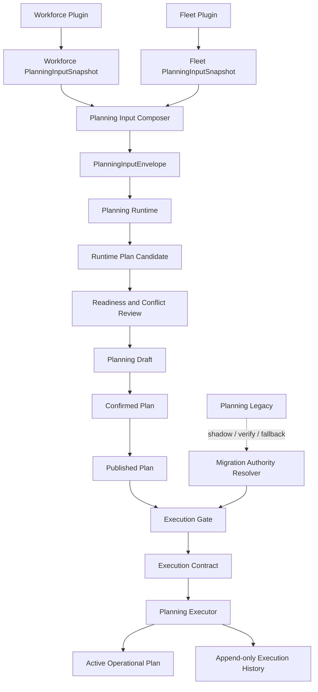
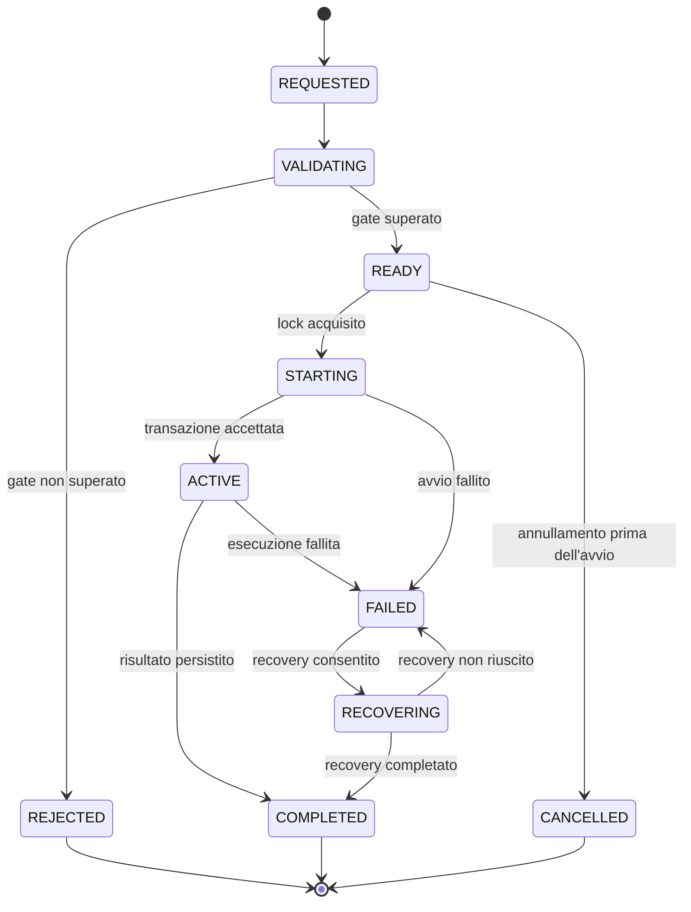
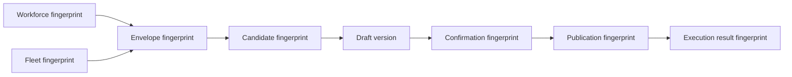

# Planning Runtime Migration Strategy

**Documento:** PW-9A  
**Stato:** strategia ufficiale proposta  
**Ambito:** migrazione controllata dal Planning legacy al Planning Runtime  
**Natura:** documento architetturale, nessuna implementazione  
**Data:** 22 luglio 2026  
**Documenti vincolanti:** `OPERATIONS_ENGINE_PHILOSOPHY.md`, `OPERATIONS_ENGINE_VISION.md`, `OPERATIONS_ENGINE_ROADMAP.md`, `PLANNING_WORKSPACE_PRODUCT_CONTRACT.md`, `PLANNING_WORKSPACE_CONTRACT_INVENTORY.md`, `PLANNING_INPUT_ALIGNMENT.md`, `OPERATIONAL_UNIT_MODEL.md`, `CORE_ADAPTER_PLUGIN_BOUNDARIES.md`, `DEVELOPMENT_SPRINT_RULES.md`

---

## 1. Scopo e valore normativo

Questo documento definisce come Operations Engine passera dal Planning Engine legacy a un Planning Runtime autorevole senza interrompere l'operativita, duplicare esecuzioni o perdere tracciabilita.

PW-9A non modifica il sistema. Stabilisce i vincoli che le implementazioni PW-9 e PW-10 dovranno rispettare.

Nel documento:

- **DEVE** e **NON DEVE** indicano un requisito obbligatorio;
- **DOVREBBE** indica una scelta raccomandata, derogabile solo con una decisione architetturale registrata;
- **PUO** indica una possibilita compatibile con la strategia;
- **scope operativo** indica la terna `organization_id + operational_unit_id + planning_date`;
- **autorita operativa** indica l'unico componente autorizzato a rendere eseguibile un piano per uno scope operativo.

In caso di conflitto, prevalgono la Costituzione e i contratti di prodotto gia vincolanti.

---

## 2. Visione della migrazione

La migrazione non sostituisce un servizio con un altro in un solo rilascio. Costruisce una catena di fiducia progressiva:

```mermaid
flowchart LR
    Inputs["Planning Input"] --> Runtime["Planning Runtime"]
    Runtime --> Readiness["Readiness"]
    Readiness --> Conflicts["Conflict Review"]
    Conflicts --> Timeline["Timeline"]
    Timeline --> Draft["Draft"]
    Draft --> Confirmation["Confirmation"]
    Confirmation --> Publication["Publication"]
    Publication --> Gate["Execution Gate - PW-9"]
    Gate --> Execution["Operational Execution"]
```



La catena fino a Publication esiste gia. Publication rende il piano ufficiale e immutabile, ma **non lo rende ancora eseguibile**. PW-9 introdurra un confine di esecuzione separato. Questo confine sara l'unico punto in cui una versione pubblicata puo diventare operativa.

La migrazione deve mantenere sempre queste proprieta:

1. una sola autorita di esecuzione per scope operativo;
2. nessuna modifica silenziosa a Draft, Confirmed Plan o Published Plan;
3. ogni esecuzione riferita a una versione e a un fingerprint immutabili;
4. rollback esplicito e auditabile;
5. nessuna dipendenza del Core da Plugin, Adapter o import Excel;
6. nessuna logica di dominio nel Workspace;
7. nessuna doppia esecuzione durante shadow, confronto o fallback.

---

## 3. Obiettivi

La strategia ha sette obiettivi:

1. mantenere il Planning legacy come fonte operativa finche il Runtime non e misurato e approvato;
2. permettere al Runtime di osservare e poi generare senza produrre effetti operativi prematuri;
3. rendere esplicita la fonte di verita in ogni fase e per ogni tipo di dato;
4. introdurre un Execution Contract stabile tra Published Plan ed esecuzione;
5. garantire scope, versioni, fingerprint, lock e idempotenza;
6. consentire rollback rapido senza perdita di storia;
7. rimuovere il legacy soltanto dopo evidenze tecniche e operative misurabili.

### 3.1 Non obiettivi

PW-9A non definisce:

- nuovi algoritmi di assegnazione;
- un Decision Engine;
- modifiche a Workforce o Fleet;
- automazioni Adapter-specifiche;
- un modello di esecuzione esterna verso sistemi terzi;
- nuove schermate o endpoint;
- dettagli fisici di schema database;
- la rimozione immediata del Planning legacy.

---

## 4. Baseline reale al termine di PW-8

La strategia parte dai contratti realmente presenti, non da un'architettura ipotetica.

| Area | Stato attuale verificato | Conseguenza per PW-9 |
|---|---|---|
| Planning Input | Snapshot Workforce e Fleet tipizzati, scoped, versionati, con freshness e validazione | Ingresso neutrale gia disponibile |
| Runtime Composition | Compone l'envelope solo quando i contratti sono compatibili e `READY` | Puo alimentare il futuro generatore |
| Legacy flag | Il report Runtime dichiara `legacy_flow_active=true` | Il passaggio di autorita non e ancora avvenuto |
| Readiness | Legata a envelope version/fingerprint, OU e data | Gate disponibile, da ricontrollare prima dell'esecuzione |
| Conflict Review | Deriva dallo stesso contesto Runtime/Readiness | Non deve diventare un secondo motore di decisione |
| Timeline | Ricostruisce eventi del percorso Planning | Deve ricevere eventi di migrazione ed esecuzione in futuro |
| Draft | Separato, versionato, modificabile solo nei metadati previsti | Non e fonte operativa |
| Confirmation | Immutabile, scoped e legata a Draft/envelope/readiness | Attesta una decisione umana su una versione |
| Publication | Immutabile, scoped, fingerprinted e unica nel contesto corrente | E un prerequisito, non un comando di esecuzione |
| Publication service | Dichiara esplicitamente che nessuna esecuzione viene avviata | Serve un Execution Gate separato |
| Planning legacy | Genera, ricalcola, modifica assegnazioni, simula/applica eventi ed espone latest/history/export | Resta oggi l'unica fonte operativa |
| Decision Engine | Non presente come autorita autonoma | Resta fuori da PW-9 |

### 4.1 Limiti attuali rilevanti

- Il Runtime attuale compone e valuta input, ma non contiene ancora un generatore operativo sostitutivo.
- Il Published Plan non trasporta ancora un payload eseguibile completo e autonomo.
- Publication permette oggi una sola pubblicazione per scope; la futura semantica di supersession richiede una decisione esplicita.
- Non esiste ancora un'autorita di migrazione persistita per organizzazione, Operational Unit e data.
- Non esiste ancora un lock distribuito dedicato all'esecuzione Planning.
- Il Planning legacy utilizza ancora modelli e servizi propri, inclusi termini verticali storici.

Questi limiti non sono corretti in PW-9A. Diventano gate della roadmap.

---

## 5. Perche non adottare un Big Bang

Un passaggio diretto dal legacy al Runtime non e accettabile per cinque ragioni.

### 5.1 Assenza di evidenza comparativa

Il Runtime non ha ancora prodotto risultati confrontabili su un campione operativo sufficiente. Sostituire il legacy prima della fase shadow impedirebbe di distinguere errori nuovi da differenze intenzionali.

### 5.2 Contratto di esecuzione ancora assente

Publication prova che un piano e stato confermato e pubblicato. Non definisce ancora come l'esecuzione viene avviata, resa idempotente, bloccata, ripresa o annullata.

### 5.3 Rischio di doppia autorita

Senza un'autorita risolta per scope, legacy e Runtime potrebbero entrambi modificare lo stato operativo. Il risultato sarebbe non deterministico e difficilmente reversibile.

### 5.4 Rollback non dimostrato

Un Big Bang rende il rollback un ritorno di versione applicativa. La strategia richiede invece un rollback di autorita controllato, per scope, senza cancellare Published Plan o storia di esecuzione.

### 5.5 Osservabilita insufficiente

Prima del cutover servono metriche di parita, stabilita, latenza, idempotenza e recovery. Senza baseline, una migrazione apparentemente riuscita puo nascondere errori operativi.

---

## 6. Architettura target



### 6.1 Confini

- Workforce e Fleet restano proprietari dei propri dati.
- Planning Input traduce i contratti pubblici in un envelope Core.
- Planning Runtime genera una proposta; non legge repository Plugin direttamente.
- Readiness e Conflict Review spiegano la qualita del contesto; non eseguono.
- Confirmation registra l'approvazione umana.
- Publication registra la versione ufficiale da distribuire.
- Execution Gate verifica se quella Publication puo diventare operativa.
- Planning Executor applica esclusivamente un Execution Contract accettato.
- Workspace osserva e invia comandi; non ricostruisce regole o autorita.
- Adapter e Plugin non vengono chiamati direttamente dal dominio Planning.

### 6.2 Un solo writer operativo

Per ogni scope operativo deve valere:

> In ogni istante esiste al massimo una autorita autorizzata a creare o modificare lo stato operativo del Planning.

Shadowing, confronto e verifica possono eseguire calcoli paralleli, ma i risultati non autorevoli sono read-only e non producono side effect.

---

## 7. Ruoli dei componenti

### 7.1 Planning Legacy

Durante la migrazione il legacy ha tre ruoli, mai contemporaneamente per lo stesso scope:

- **autorita operativa** nelle Fasi 0, 1 e 2;
- **fallback disattivato** nella Fase 3, attivabile solo da rollback esplicito;
- **assente** nella Fase 4.

Il legacy non deve leggere o modificare internamente Published Plan. L'integrazione deve avvenire attraverso boundary espliciti.

### 7.2 Planning Runtime

Il Runtime:

- consuma PlanningInputEnvelope;
- produce risultati deterministici e versionati;
- espone diagnostica e compatibilita;
- non accede direttamente a repository Workforce o Fleet;
- non diventa autorita per il solo fatto di aver generato un candidato;
- diventa autorita solo quando la fase di migrazione e l'Execution Gate lo consentono.

### 7.3 Published Plan

Il Published Plan:

- e una versione ufficiale, immutabile e scoped;
- conserva identita, versione, fingerprint, actor e timestamp;
- riferisce un Confirmed Plan immutabile;
- non equivale a esecuzione;
- non viene sovrascritto;
- puo essere rifiutato dall'Execution Gate se non e piu eleggibile.

### 7.4 Planning Workspace

Il Workspace:

- mostra stato, provenienza e motivo dei blocchi;
- richiede azioni esplicite per conferma, pubblicazione ed esecuzione;
- non decide quale motore sia autorevole;
- non confronta algoritmi;
- non calcola fingerprint;
- non implementa retry applicativi nascosti;
- non trasforma un placeholder o uno stato legacy in una prova di readiness.

---

## 8. Fonti di verita

La frase "fonte di verita" viene separata per evitare ambiguita.

| Dimensione | Fonte autorevole |
|---|---|
| Persone, turni, availability Workforce | Workforce Plugin, tramite contratto pubblico |
| Asset e availability Fleet | Fleet Plugin, tramite contratto pubblico |
| Configurazione risolta | Configuration Engine |
| Input usati dal Runtime | PlanningInputEnvelope identificato da version/fingerprint |
| Approvazione umana | Confirmed Plan |
| Versione ufficiale distribuita | Published Plan |
| Motore autorizzato a eseguire | Migration Authority per scope |
| Piano attivo | Execution Contract accettato e relativo stato di esecuzione |
| Audit | Registri append-only di Confirmation, Publication, Authority ed Execution |

Nessun singolo oggetto sostituisce tutte queste fonti. In particolare, Published Plan e Active Operational Plan non sono sinonimi.

### 8.1 Fonte di verita per fase

| Fase | Generazione candidata | Piano operativo/esecuzione | Publication | Legacy |
|---|---|---|---|---|
| 0 - Legacy unico | Legacy | Legacy | Informativa, non eseguibile | Autorita unica |
| 1 - Runtime osserva | Legacy; Runtime produce solo diagnostica/shadow | Legacy | Informativa, non eseguibile | Autorita unica |
| 2 - Runtime genera, Legacy verifica | Runtime produce candidato; Legacy produce verifica comparativa | Legacy fino a cutover | Riferimento del candidato approvato, non ancora eseguibile dal Runtime | Autorita operativa e verificatore |
| 3 - Runtime esegue | Runtime | Runtime | Sorgente obbligatoria dell'Execution Contract | Fallback spento |
| 4 - Legacy rimosso | Runtime | Runtime | Sorgente obbligatoria dell'Execution Contract | Assente |

---

## 9. Identita dello scope operativo

La chiave minima di ogni comando, lock, confronto, metrica e audit e:

| Campo | Regola |
|---|---|
| Organization | Identificatore stabile e obbligatorio |
| Operational Unit | Identificatore Core stabile; mai la label e mai `Tutte` |
| Planning date | Data operativa locale, non data di creazione del record |

La vista `Tutte` resta aggregazione di lettura. Non puo generare, confermare, pubblicare, eseguire o ottenere un lock.

Una modifica di organization, Operational Unit o planning date produce un nuovo scope. Non e consentito correggere lo scope mutando un oggetto gia confermato, pubblicato o eseguito.

---

## 10. Published Plan Contract

### 10.1 Contratto disponibile oggi

Il contratto esistente conserva gia:

- `publication_id`;
- organization, Operational Unit e planning date;
- stato `PUBLISHED`;
- versione Publication;
- identificatore, versione e fingerprint della Confirmation;
- fingerprint della Publication;
- actor;
- timestamp di pubblicazione;
- risultato di validazione.

Il fingerprint attuale include scope, versione Publication e identita/versione/fingerprint del Confirmed Plan tramite serializzazione canonica e SHA-256.

### 10.2 Requisiti prima dell'esecuzione

Per essere sorgente di un Execution Contract, un Published Plan DEVE inoltre rendere risolvibili, direttamente o tramite riferimenti immutabili:

- il payload operativo completo;
- la versione del PlanningInputEnvelope;
- il fingerprint dell'envelope;
- la versione delle regole Runtime applicate;
- la versione della configurazione risolta;
- la provenance del generatore;
- l'eventuale relazione di supersession con una Publication precedente.

Questi requisiti non vengono implementati in PW-9A. La loro forma persistente deve essere definita in PW-9 prima di attivare la Fase 2.

### 10.3 Immutabilita

Un Published Plan non viene aggiornato per diventare eseguibile. L'eleggibilita e una valutazione separata e timestamped. Una correzione produce una nuova catena Draft -> Confirmation -> Publication.

---

## 11. Execution Contract

L'Execution Contract e il confine tra "piano ufficiale" e "piano operativo". Deve essere neutrale, immutabile, serializzabile e indipendente da UI, Plugin e Adapter.

### 11.1 Identita minima

| Gruppo | Informazioni obbligatorie |
|---|---|
| Execution | execution id, contract version, stato, mode |
| Scope | organization id, Operational Unit id, planning date |
| Publication | publication id, version, fingerprint |
| Confirmation | confirmation id, version, fingerprint |
| Input | envelope id, version, fingerprint |
| Runtime | Runtime release, rules version, configuration version |
| Autorita | migration phase, authority, authority decision id |
| Comando | idempotency key, correlation id, causation id, actor |
| Tempo | requested at, accepted at, started at, completed at |
| Risultato | result fingerprint, outcome, error code sanitizzato |

### 11.2 Invarianti

1. Lo scope dell'Execution Contract coincide con Publication, Confirmation ed envelope.
2. Il fingerprint della Publication viene ricalcolato e verificato prima dell'accettazione.
3. Una Publication puo avere al massimo una esecuzione attiva.
4. Lo stesso idempotency key restituisce lo stesso risultato logico.
5. Nessuna esecuzione puo iniziare senza autorita Runtime per quello scope.
6. Un contratto accettato non viene mutato; le transizioni generano record/eventi append-only.
7. Nessuna risposta tardiva puo sostituire un'esecuzione piu recente.
8. Il risultato deve essere correlabile al Published Plan originale.

### 11.3 Modalita

| Mode | Side effect operativo | Uso |
|---|---:|---|
| `SHADOW` | No | Fase 1, diagnostica e misure |
| `VERIFY` | No | Fase 2, confronto Runtime/legacy |
| `EXECUTE` | Si | Fasi 3 e 4 |
| `FALLBACK` | Si, solo legacy | Rollback esplicito in Fase 3 |

`SHADOW` e `VERIFY` non possono scrivere tabelle o proiezioni operative. Possono scrivere esclusivamente audit e metriche tecniche prive di dati personali non necessari.

---

## 12. Execution Lifecycle



### 12.1 Significato degli stati

| Stato | Significato |
|---|---|
| `REQUESTED` | Comando ricevuto, nessuna validazione implicita |
| `VALIDATING` | Verifica scope, versione, fingerprint, freshness, autorita e lock |
| `REJECTED` | Precondizione non soddisfatta; nessun side effect |
| `READY` | Contratto valido e autorizzato, non ancora operativo |
| `STARTING` | Lock detenuto e transazione di attivazione in corso |
| `ACTIVE` | Piano attivo per lo scope |
| `COMPLETED` | Attivazione completata e risultato persistito |
| `FAILED` | Fallimento registrato e classificato |
| `RECOVERING` | Recovery idempotente in corso |
| `CANCELLED` | Richiesta annullata prima di effetti operativi |

Un rollback di autorita non riscrive questi stati. Produce un evento separato e, se necessario, una nuova esecuzione in modalita `FALLBACK`.

---

## 13. Fasi di migrazione

### 13.1 Fase 0 - Legacy unico

**Fonte di verita**

- Il Planning legacy genera e mantiene il piano operativo.
- Runtime, Draft, Confirmation e Publication non autorizzano esecuzione.

**Responsabilita**

- Legacy: generazione, ricalcolo, modifiche, eventi ed export operativi.
- Runtime: contratti preparatori senza autorita.
- Workspace: mostra chiaramente lo stato legacy.

**Rischi**

- Dipendenza dal modello legacy.
- Scope Operational Unit ancora non uniforme in tutti i percorsi legacy.
- Publication interpretabile erroneamente come esecuzione.

**Rollback**

- Non applicabile come switch di motore: questa e la baseline.
- Un problema nelle componenti PW-1-PW-8 non deve influire sul legacy.

**Metriche**

- tasso di successo legacy;
- latenza p50/p95/p99;
- errori per operazione;
- numero di piani generati e modificati;
- incidenti di scope o duplicazione.

**Criterio di uscita**

- baseline misurata;
- dataset di confronto disponibili;
- Execution Contract approvato ma non attivo;
- osservabilita separata per scope.

### 13.2 Fase 1 - Legacy esegue, Runtime osserva

**Fonte di verita**

- Legacy resta l'unica fonte operativa.
- Runtime produce diagnostica o candidato shadow non persistito come piano attivo.

**Responsabilita**

- Legacy: comportamento invariato.
- Runtime: compone input, valuta compatibilita e, quando disponibile, calcola in modalita `SHADOW`.
- Comparator: misura differenze senza dichiarare automaticamente corretto uno dei due risultati.

**Rischi**

- Carico duplicato di calcolo.
- Metriche contaminate da input non identici.
- Logging eccessivo o contenente dati personali.
- Shadow accidentalmente connesso a repository operativi.

**Rollback**

- Disabilitare il calcolo shadow per scope o globalmente.
- Nessun dato operativo da ripristinare.

**Metriche**

- percentuale scope con envelope `READY`;
- compatibilita input;
- latenza shadow e overhead sul legacy;
- error rate Runtime;
- fingerprint mismatch;
- zero scritture operative da Runtime.

**Criterio di uscita**

- almeno un periodo operativo concordato senza side effect Runtime;
- copertura rappresentativa di OU, date e casi limite;
- zero violazioni di scope;
- diagnostica sufficiente a spiegare ogni divergenza.

### 13.3 Fase 2 - Runtime genera, Legacy verifica

**Fonte di verita**

- Runtime e la fonte del candidato da valutare.
- Legacy resta l'autorita di esecuzione.
- Nessun candidato Runtime diventa operativo direttamente.

**Responsabilita**

- Runtime: genera un candidato deterministico da un envelope fissato.
- Legacy: produce una verifica comparativa sullo stesso scenario o applica il percorso operativo ancora vigente.
- Comparator: classifica differenze semantiche, non solo differenze seriali.
- Operatore: approva i casi che richiedono giudizio operativo.

**Rischi**

- Confronto tra input o istanti diversi.
- Falsa parita dovuta a ordinamenti o identificatori non semantici.
- Legacy usato come verita assoluta anche quando contiene un comportamento noto da superare.
- Candidate Runtime pubblicato ma erroneamente considerato eseguito.

**Rollback**

- Tornare alla Fase 1 per lo scope interessato.
- Conservare risultati e divergenze come audit, senza trasformarli in piani attivi.

**Metriche**

- equivalenza di Task inclusi;
- equivalenza e qualita delle assegnazioni;
- conflitti bloccanti e warning per motore;
- capacity e margine per OU;
- tasso di approvazione umana;
- divergenze spiegate/non spiegate;
- determinismo su ripetizione dello stesso fingerprint.

**Criterio di uscita**

- soglie di parita approvate dal product owner operativo;
- tutte le divergenze critiche spiegate;
- Runtime deterministico;
- recovery e idempotenza verificati;
- runbook di Fase 3 provato in staging.

### 13.4 Fase 3 - Runtime genera ed esegue, Legacy fallback

**Fonte di verita**

- Runtime e l'unica autorita di esecuzione per gli scope abilitati.
- Published Plan e prerequisito obbligatorio dell'Execution Contract.
- Legacy e spento e non riceve traffico operativo ordinario.

**Responsabilita**

- Authority Resolver: abilita Runtime per scope.
- Execution Gate: valida il Published Plan e acquisisce il lock.
- Runtime Executor: attiva il piano in modo idempotente.
- Legacy: disponibile solo tramite procedura di fallback esplicita.

**Rischi**

- fallback dopo side effect parziale;
- attivazione contemporanea dei due motori;
- lock non distribuito in presenza di piu repliche;
- Published Plan non autosufficiente;
- rollback usato come retry automatico.

**Rollback**

1. bloccare nuove esecuzioni Runtime per lo scope;
2. determinare se esiste un'esecuzione `ACTIVE` o parziale;
3. completare o compensare il tentativo corrente; mai avviare legacy in parallelo;
4. registrare il cambio di autorita con actor e motivo;
5. abilitare `FALLBACK` legacy soltanto per una nuova execution intent;
6. verificare il piano attivo e comunicare lo stato al Workspace.

**Metriche**

- successo end-to-end;
- tempo Publication -> Active Plan;
- lock contention;
- retry e deduplicazioni;
- recovery riusciti;
- fallback rate e motivi;
- MTTR;
- zero doppie esecuzioni;
- zero cross-OU leakage.

**Criterio di uscita**

- periodo di stabilita concordato per ogni coorte;
- nessun fallback critico irrisolto;
- SLO raggiunti;
- restore e disaster recovery verificati;
- nessun consumer dipende piu dal legacy come percorso primario.

### 13.5 Fase 4 - Legacy rimosso

**Fonte di verita**

- Runtime e unica fonte di generazione ed esecuzione.
- Published Plan e Execution History sono i riferimenti ufficiali.

**Responsabilita**

- Runtime: ciclo completo.
- Repository storici legacy: sola conservazione secondo retention, poi archiviazione/rimozione controllata.
- Workspace e consumer: solo contratti Core.

**Rischi**

- dipendenze nascoste non censite;
- perdita di capacita forense su dati legacy;
- rollback impossibile dopo la rimozione binaria o dati non migrati.

**Rollback**

- Non e piu un semplice switch applicativo.
- Prima della rimozione deve esistere un artefatto di release ripristinabile e una copia verificata dei dati necessari.
- Dopo la finestra di irreversibilita, il recovery usa solo Runtime e backup, non il vecchio motore.

**Metriche**

- riferimenti legacy a runtime uguali a zero;
- chiamate agli endpoint legacy uguali a zero nel periodo di osservazione;
- job, import e dashboard senza dipendenze legacy;
- audit e retention completi;
- error budget Runtime rispettato.

**Criterio di completamento**

- checklist di rimozione approvata;
- dipendenze statiche e dinamiche azzerate;
- almeno un ciclo di disaster recovery Runtime completato;
- decisione irreversibile registrata.

---

## 14. Autorita di migrazione

La fase non deve essere dedotta da feature frontend, presenza di una Publication o disponibilita del legacy. Serve una decisione Core esplicita e auditabile.

### 14.1 Risoluzione

L'autorita viene risolta almeno per:

- organization;
- Operational Unit;
- intervallo di date operative;
- fase di migrazione;
- versione Runtime autorizzata;
- istante di efficacia;
- actor e motivo.

La configurazione globale puo definire un default prudente, ma un override deve restringere lo scope, non ampliarlo implicitamente.

### 14.2 Regole

- In assenza di una decisione valida, il default fino alla Fase 3 e Legacy.
- In Fase 3, un nuovo scope non viene abilitato automaticamente per ereditarieta ambigua.
- Un cambio di autorita non puo avvenire durante una esecuzione `STARTING`, `ACTIVE` o `RECOVERING`.
- Ogni cambio produce un evento append-only.
- Il Workspace visualizza l'autorita risolta, ma non la calcola.

---

## 15. Versionamento

### 15.1 Livelli distinti

| Livello | Scopo della versione |
|---|---|
| Contract version | Compatibilita dello schema pubblico |
| Input version | Identita del contenuto prodotto da Workforce/Fleet |
| Envelope version | Identita dell'insieme coerente di input |
| Runtime/rules version | Identita del generatore e delle regole |
| Draft version | Concorrenza e storia della proposta modificabile |
| Confirmation version | Approvazione immutabile |
| Publication version | Versione ufficiale distribuita |
| Execution attempt/version | Tentativo operativo e relativo risultato |

Queste versioni non devono essere compresse in un unico numero.

### 15.2 Compatibilita

- Le versioni di contratto seguono compatibilita esplicita, non confronto lessicografico.
- Un consumer rifiuta una major non supportata.
- Una minor retrocompatibile puo essere accettata solo se i campi obbligatori mantengono semantica invariata.
- Runtime e regole usate devono restare ricostruibili per ogni esecuzione.
- Una modifica a input, configurazione o regole genera una nuova identita del candidato.

---

## 16. Fingerprint

Il fingerprint dimostra integrita del contenuto, non correttezza operativa.

### 16.1 Regole canoniche

- serializzazione deterministica;
- chiavi ordinate;
- timezone e date normalizzate;
- esclusione di campi volatili non semantici;
- inclusione esplicita della contract version;
- algoritmo crittografico dichiarato e versionabile;
- ricalcolo al confine di ogni transizione critica.

SHA-256 e gia usato nei contratti Planning esistenti e resta la baseline.

### 16.2 Catena



Ogni livello conserva il riferimento al precedente. Un mismatch blocca la transizione; non viene corretto automaticamente.

### 16.3 Dati personali

I fingerprint non sostituiscono la minimizzazione. I payload grezzi non devono essere copiati nei log. Se il contenuto include identificatori personali necessari, il digest resta un dato correlabile e segue la stessa policy di accesso e retention del contratto sorgente.

---

## 17. Operational Unit e date operative

### 17.1 Operational Unit

- L'identificatore stabile Core e obbligatorio in ogni contratto.
- Label, station legacy o nomi Adapter non sono identita.
- `Tutte` e solo una vista aggregata.
- Il confronto cross-unit e vietato salvo funzione esplicita futura.
- Un fallback si applica a una OU precisa; non cambia automaticamente tutta l'organizzazione.

### 17.2 Planning date

- `planning_date` e la data dell'operazione, non `created_at`, `published_at` o la data UTC corrente.
- Gli istanti sono timezone-aware e conservati in formato non ambiguo.
- Il calendario locale dell'Operational Unit determina la data operativa.
- Un processo oltre mezzanotte mantiene la planning date originale.
- Cambiare planning date richiede una nuova catena contrattuale.

### 17.3 Clock e determinismo

I servizi di dominio ricevono l'istante di valutazione. Non leggono implicitamente l'orologio di sistema quando la scelta influenza validazione, freshness o autorita.

---

## 18. Concorrenza e lock

### 18.1 Concorrenza ottimistica

Draft, Confirmation, Publication ed Execution devono verificare le versioni attese. Un client basato su una versione obsoleta riceve un conflitto esplicito e deve ricaricare.

### 18.2 Lock di esecuzione

Prima di passare da `READY` a `STARTING`, il sistema deve acquisire un lock distribuito sullo scope operativo.

Il lock deve avere:

- chiave deterministica dello scope;
- owner/holder identificabile;
- execution id;
- istante di acquisizione;
- scadenza o lease controllato;
- fencing token monotono oppure garanzia transazionale equivalente;
- rilascio sicuro anche in caso di errore.

Un lock solo in memoria non e sufficiente su piu processi o repliche. La scelta tra advisory lock PostgreSQL e tabella/lease transazionale viene rinviata a PW-9, ma la semantica sopra e obbligatoria.

### 18.3 Ordine delle operazioni

1. risolvere autorita;
2. caricare Publication corrente;
3. verificare versioni e fingerprint;
4. acquisire lock;
5. ripetere le verifiche dentro il confine transazionale;
6. registrare l'Execution Contract;
7. applicare lo stato operativo;
8. registrare risultato ed eventi;
9. rilasciare lock.

---

## 19. Idempotenza, retry e failure recovery

### 19.1 Idempotenza

- Ogni comando di esecuzione richiede un idempotency key.
- Lo stesso key con lo stesso payload restituisce lo stesso risultato logico.
- Lo stesso key con payload diverso viene rifiutato.
- L'unicita deve essere garantita dal boundary persistente, non dalla UI.
- Un doppio click o una ritrasmissione di rete non crea due esecuzioni.

### 19.2 Retry

| Categoria | Retry | Regola |
|---|---:|---|
| Timeout prima dell'accettazione | Si | stesso idempotency key |
| Errore transitorio database senza commit | Si | backoff limitato e jitter |
| Version mismatch | No automatico | ricaricare e richiedere nuova decisione |
| Fingerprint mismatch | No | blocco e diagnosi |
| Scope/authority mismatch | No | correzione esplicita |
| Side effect parziale | Solo recovery | mai rilanciare alla cieca |
| Errore di validazione | No | remediation prima di un nuovo comando |

Il retry non puo cambiare motore. Un errore Runtime non autorizza automaticamente il legacy.

### 19.3 Failure recovery

Il recovery deve distinguere:

1. **prima di ogni side effect:** marcare FAILED e consentire retry idempotente;
2. **durante una transazione atomica:** rollback completo e audit dell'errore;
3. **dopo commit ma prima della risposta:** recuperare il risultato tramite idempotency key;
4. **dopo side effect parziale non atomico:** entrare in `RECOVERING`, riconciliare e solo dopo chiudere o autorizzare fallback;
5. **perdita del processo:** usare lock/lease e stato persistito per riprendere senza doppia esecuzione.

Gli errori esposti restano tipizzati e sanitizzati. Stack trace e payload sensibili restano nei canali tecnici autorizzati.

---

## 20. Quando un Published Plan diventa eseguibile

Un Published Plan e eseguibile solo quando tutte le condizioni seguenti sono vere nello stesso istante di valutazione:

1. lo stato e `PUBLISHED`;
2. Publication, Confirmation, envelope e candidato condividono lo scope;
3. versioni e fingerprint sono coerenti e ricalcolati;
4. il payload operativo completo e risolvibile e immutabile;
5. Runtime e contract version sono compatibili;
6. freshness e policy di revalidation sono soddisfatte;
7. non esiste un'esecuzione attiva o completata per la stessa intent;
8. la Migration Authority autorizza Runtime in modalita `EXECUTE`;
9. l'idempotency key e valido;
10. il lock dello scope e acquisito;
11. l'Execution Contract e persistito con successo;
12. nessun blocker emerso dopo Publication invalida la catena.

Publication da sola non soddisfa mai queste condizioni.

---

## 21. Quando il Legacy viene ignorato

Il legacy viene ignorato, ma non rimosso, nella Fase 3 quando:

- lo scope e esplicitamente assegnato al Runtime;
- l'Execution Gate e operativo;
- il Published Plan e eseguibile;
- monitoring e alerting sono attivi;
- il fallback runbook e stato provato;
- nessuna esecuzione legacy e in corso per lo scope.

"Ignorato" significa che non riceve comandi ordinari e non viene interrogato per determinare il piano attivo. Puo restare disponibile per diagnostica read-only e fallback manuale controllato.

---

## 22. Quando il Legacy viene rimosso

La rimozione avviene solo in Fase 4 e richiede tutte le condizioni seguenti:

- tutte le Operational Unit di produzione hanno completato la Fase 3;
- nessun fallback per un periodo concordato;
- zero traffico operativo legacy misurato;
- tutti i consumer usano contratti Core;
- dati e audit necessari sono migrati o conservati secondo retention;
- restore Runtime verificato;
- rollback di release verificato entro la finestra prevista;
- dipendenze statiche, job e configurazioni legacy censiti e rimossi;
- approvazione congiunta tecnica e operativa;
- data di irreversibilita registrata.

La rimozione deve essere separata in almeno due atti:

1. disabilitazione e osservazione;
2. eliminazione di codice e infrastruttura dopo la finestra di sicurezza.

---

## 23. Strategia di rollback

### 23.1 Principi

- Il rollback cambia autorita futura; non riscrive la storia.
- Non si avviano due motori sullo stesso scope.
- Un Published Plan resta immutabile anche se non viene eseguito.
- Un'esecuzione parziale deve essere riconciliata prima del fallback.
- Il rollback e scoped e auditabile.

### 23.2 Matrice

| Da fase | A fase | Azione | Dati conservati |
|---|---|---|---|
| 1 | 0 | disabilita shadow | metriche e audit shadow |
| 2 | 1 | disabilita generazione candidata | confronti e divergenze |
| 3 | 2 | blocca Runtime, riconcilia, cambia autorita, riabilita legacy | Publication, Execution History, eventi di rollback |
| 4 | 3 | solo entro finestra e con artefatto legacy conservato | audit e dati migrati |

### 23.3 Trigger

- doppia esecuzione o rischio concreto di doppia esecuzione;
- corruzione o mismatch di fingerprint non spiegato;
- violazione di scope;
- tasso di fallimento oltre soglia;
- recovery non completabile entro SLO;
- divergenza operativa critica;
- perdita di audit o impossibilita di ricostruzione.

### 23.4 Autorita di rollback

Il rollback richiede actor autorizzato, motivo, scope, fase precedente, fase destinazione, timestamp e riferimento all'incidente. Il comando deve essere idempotente.

---

## 24. Componenti PW-9

### 24.1 Componenti che devono cambiare o essere introdotti

La sequenza PW-9 dovra, in sprint separati e piccoli:

- definire il Runtime Plan Candidate neutrale;
- definire il Published Plan eseguibile o i suoi riferimenti immutabili;
- introdurre Execution Contract e lifecycle;
- introdurre Migration Authority Resolver;
- introdurre Execution Gate;
- introdurre lock distribuito e idempotency boundary;
- introdurre Planning Executor;
- introdurre audit append-only di authority ed execution;
- introdurre comparator semantico legacy/Runtime;
- introdurre metriche, tracing e runbook;
- collegare il Runtime prima in `SHADOW`, poi `VERIFY`, infine `EXECUTE`;
- esporre stato al Workspace solo dopo la stabilizzazione del contratto backend.

### 24.2 Componenti che non devono cambiare per ottenere il cutover

- ownership e repository interni Workforce;
- ownership e repository interni Fleet;
- Amazon Adapter e altri Adapter;
- import Excel e Workbook Profiler;
- regole del Decision Engine, che resta assente;
- significato di Draft, Confirmation e Publication;
- storico immutabile gia prodotto;
- Configuration Engine come servizio Core;
- Mission Control e Learn;
- API pubbliche legacy durante Fasi 0-3, salvo deprecazione esplicita futura.

### 24.3 Dipendenze consentite

Il nuovo dominio Execution puo dipendere da contratti Core e porte astratte. Non puo dipendere da FastAPI, frontend, repository Plugin, file Excel o Adapter verticali.

---

## 25. Strategia di test

### 25.1 Test di contratto

- serializzazione e compatibilita delle versioni;
- immutabilita di Published Plan ed Execution Contract;
- scope e data;
- catena dei fingerprint;
- errori tipizzati;
- idempotency key.

### 25.2 Test di dominio

- transizioni lifecycle valide e invalide;
- autorita consentita e negata;
- Publication non eseguibile senza gate;
- freshness e revalidation;
- retry classificato;
- recovery senza duplicazione;
- rollback di autorita append-only.

### 25.3 Test differenziali

Lo stesso snapshot deve essere eseguito in legacy e Runtime con:

- identico scope;
- stesso istante di valutazione;
- stessi input e configurazione semanticamente equivalenti;
- normalizzazione degli ordinamenti non significativi;
- confronto di Task, assegnazioni, conflitti, capacity e stato.

Ogni divergenza riceve codice, severita, motivazione ed esito di triage.

### 25.4 Test di concorrenza

- due richieste simultanee stesso scope;
- stesso idempotency key;
- key diverso, stessa Publication;
- lock scaduto e fencing token obsoleto;
- due repliche applicative;
- risposta tardiva;
- cambio autorita durante esecuzione.

### 25.5 Test di failure injection

- crash prima e dopo commit;
- perdita connessione;
- timeout;
- lock holder interrotto;
- errore durante audit;
- fingerprint modificato;
- Publication superseded;
- storage temporaneamente indisponibile.

### 25.6 Test end-to-end per fase

Ogni fase ha una suite dedicata. Nessuna suite successiva sostituisce i test legacy finche il legacy resta fallback.

---

## 26. Strategia QA

### 26.1 Ambienti

1. locale con fixture sintetiche;
2. CI con database isolato;
3. staging equivalente a Railway;
4. produzione in shadow;
5. produzione per coorti di Operational Unit.

### 26.2 Dataset

Il set QA deve includere:

- giornata vuota;
- input mancanti, parziali, stale e invalidi;
- singola e multiple OU senza aggregare le esecuzioni;
- capacita insufficiente;
- risorse duplicate o indisponibili;
- modifiche tra Confirmation e Publication;
- doppio comando;
- concorrenza e recovery;
- cambio data vicino alla mezzanotte locale.

Non si usano dati personali reali nei test automatici.

### 26.3 Evidenze

Per ogni promozione vengono conservati:

- release e contract version;
- dataset/fingerprint;
- risultati legacy e Runtime;
- diff semanticamente normalizzato;
- metriche;
- esito Go/No-Go;
- approvatori;
- prova di rollback.

---

## 27. Strategia di deploy

La migrazione usa un approccio expand-observe-enable-contract.

### 27.1 Expand

Distribuire i nuovi contratti e servizi disattivati. Database e API restano retrocompatibili. Nessun cambio di autorita.

### 27.2 Observe

Abilitare shadow per scope selezionati. Misurare senza scritture operative.

### 27.3 Verify

Abilitare generazione Runtime e confronto legacy. Publication resta non eseguibile dal Runtime.

### 27.4 Enable

Abilitare Fase 3 per una coorte minima di OU e date future. Il cambio e esplicito, osservabile e reversibile.

### 27.5 Expand cohort

Ampliare solo dopo il periodo di osservazione e il superamento dei gate. Nessun rollout globale automatico.

### 27.6 Contract

Dopo la Fase 4, rimuovere percorsi e dati legacy non piu necessari con sprint dedicato, backup verificato e finestra di rollback dichiarata.

### 27.7 Compatibilita Railway

Il deploy deve assumere piu repliche possibili anche se oggi ne esiste una. Lock e idempotenza non possono dipendere dal singolo processo Uvicorn. Nessun cambio Railway viene effettuato in PW-9A.

---

## 28. Metriche e osservabilita

### 28.1 Metriche obbligatorie

- envelope per stato;
- candidate generation success/failure;
- latenza per motore;
- diff rate totale e critico;
- execution success/failure;
- idempotency hit/conflict;
- lock wait/contention/expiry;
- recovery e fallback;
- mismatch di scope/version/fingerprint;
- Published Plan non eseguibili per causa;
- tempo medio Publication -> Active Plan.

### 28.2 Correlazione

Log, metriche e tracing usano correlation id, execution id e riferimenti non sensibili. Organization, OU e data possono essere etichette operative controllate; identificatori ad alta cardinalita non devono diventare label metriche indiscriminate.

### 28.3 Alert minimi

- possibile doppia esecuzione;
- lock orfano o scaduto con esecuzione attiva;
- fingerprint mismatch;
- cross-OU mismatch;
- recovery bloccato;
- fallback attivato;
- divergenza critica in Fase 2;
- perdita dell'audit.

---

## 29. Checklist Go/No-Go

### 29.1 Gate universale

- [ ] Scope organization + Operational Unit + planning date completo.
- [ ] Vista `Tutte` esclusa dai comandi mutanti.
- [ ] Contract version supportata.
- [ ] Versioni e fingerprint coerenti.
- [ ] Audit append-only disponibile.
- [ ] Nessun dato personale non necessario nei log.
- [ ] Test unitari, integrazione, concorrenza e recovery superati.
- [ ] OpenAPI confrontata quando lo sprint modifica API.
- [ ] Backup e restore verificati quando lo sprint modifica persistenza.
- [ ] Runbook rollback provato.
- [ ] Metriche e alert attivi.
- [ ] Nessuna dipendenza Core -> Plugin/Adapter/repository interno.
- [ ] Nessuna doppia autorita per scope.

### 29.2 Go Fase 1

- [ ] Shadow privo di side effect per costruzione e per test.
- [ ] Overhead entro soglia.
- [ ] Baseline legacy disponibile.
- [ ] Disattivazione shadow immediata e scoped.

### 29.3 Go Fase 2

- [ ] Runtime Candidate deterministico.
- [ ] Comparator semantico approvato.
- [ ] Stessi input e istante per entrambi i motori.
- [ ] Divergenze critiche spiegate.
- [ ] Legacy resta unica autorita operativa.

### 29.4 Go Fase 3

- [ ] Published Plan autosufficiente o riferimenti immutabili risolvibili.
- [ ] Execution Gate completo.
- [ ] Lock distribuito e idempotenza testati su piu processi.
- [ ] Recovery da side effect parziale provato.
- [ ] Authority Resolver persistito e auditabile.
- [ ] Coorte iniziale limitata.
- [ ] Operatori informati sul fallback.

### 29.5 Go Fase 4

- [ ] Zero traffico legacy nel periodo concordato.
- [ ] Zero fallback irrisolti.
- [ ] Dipendenze legacy azzerate.
- [ ] Retention e migrazione dati approvate.
- [ ] Disaster recovery Runtime riuscito.
- [ ] Approvazione esplicita dell'irreversibilita.

Un solo elemento obbligatorio non soddisfatto produce **NO-GO**.

---

## 30. Rischi principali e mitigazioni

| Rischio | Impatto | Mitigazione obbligatoria |
|---|---|---|
| Doppia autorita | Critico | authority scoped, lock distribuito, single writer |
| Input diversi nel confronto | Alto | envelope e fingerprint condivisi |
| Publication scambiata per esecuzione | Alto | Execution Gate e stati separati |
| Fallback dopo side effect parziale | Critico | recovery prima del cambio motore |
| Lock solo in memoria | Critico su piu repliche | lock PostgreSQL/lease con fencing |
| Fingerprint incompleto | Alto | catena canonica e versionata |
| Scope OU ambiguo | Critico | identificatore Core obbligatorio; `Tutte` read-only |
| Legacy assunto sempre corretto | Medio/alto | diff con triage umano e criteri semantici |
| Published Plan non autosufficiente | Alto | gate PW-9 prima della Fase 2/3 |
| Retry che duplica effetti | Critico | idempotency persistente |
| Rimozione prematura | Critico | Fase 4 separata e metriche zero-usage |
| Dati personali nei log shadow | Alto | minimizzazione e audit dei campi |
| Contratti troppo accoppiati al DB | Medio | dominio e porte astratte |

---

## 31. Decisioni prese

1. Nessun Big Bang.
2. Cinque fasi, da Legacy unico a Runtime unico.
3. Una sola autorita operativa per scope.
4. Published Plan non equivale a esecuzione.
5. Execution Gate separato e obbligatorio.
6. Execution Contract immutabile e fingerprinted.
7. Shadow e Verify non producono side effect.
8. Il fallback non e un retry automatico.
9. `Tutte` non e uno scope mutante.
10. Lock e idempotenza devono essere distribuiti/persistenti.
11. Versioni di input, regole, Draft, Confirmation, Publication ed Execution restano distinte.
12. Il legacy viene prima ignorato, poi rimosso in una fase separata.
13. Decision Engine, Plugin e Adapter non entrano nel percorso di migrazione PW-9.
14. Ogni rollback conserva la storia.

---

## 32. Decisioni rimandate

Le seguenti scelte richiedono ADR o specifica dedicata in PW-9:

- struttura definitiva del Runtime Plan Candidate;
- payload completo o reference model del Published Plan eseguibile;
- semantica di supersession e nuova Publication sullo stesso scope;
- tecnologia concreta del lock distribuito PostgreSQL;
- durata lease e strategia fencing;
- SLO e soglie numeriche di parita/fallback;
- durata minima delle finestre di Fase 1, 2 e 3;
- strategia di archiviazione dei dati legacy;
- superficie API dell'Execution Contract;
- autorizzazioni degli actor per execute e rollback;
- granularita delle coorti di rollout;
- forma del comparator per differenze intenzionali;
- integrazione futura con eventi esterni o Adapter;
- momento in cui gli endpoint legacy vengono deprecati e poi rimossi.

Nessuna di queste decisioni puo essere risolta implicitamente nel frontend o nel codice infrastrutturale.

---

## 33. Roadmap PW-9

PW-9 deve essere suddiviso in incrementi verificabili. La numerazione seguente e proposta strategica, non autorizzazione a implementare.

| Sprint | Obiettivo | Autorita operativa |
|---|---|---|
| PW-9B | Specifica e modelli di Candidate, Execution Contract e Authority | Legacy |
| PW-9C | Repository/audit, idempotenza e lock; nessuna esecuzione Runtime | Legacy |
| PW-9D | Runtime generator in shadow e osservabilita | Legacy |
| PW-9E | Comparator semantico e modalita Verify | Legacy |
| PW-9F | Execution Gate e recovery in staging | Legacy |
| PW-9G | Canary Fase 3 su coorte limitata | Runtime per scope abilitati |
| PW-9H | Estensione controllata delle coorti e hardening | Runtime per scope abilitati |

Ogni sprint deve rispettare `DEVELOPMENT_SPRINT_RULES.md`, avere un solo obiettivo e lasciare il sistema deployabile.

---

## 34. Roadmap PW-10

PW-10 e dedicato alla conclusione della migrazione, non a nuove funzionalita di prodotto.

| Sprint | Obiettivo |
|---|---|
| PW-10A | Audit completo delle dipendenze legacy e zero-usage window |
| PW-10B | Migrazione/retention dati e consumer residui |
| PW-10C | Disabilitazione permanente del percorso legacy |
| PW-10D | Osservazione post-disabilitazione e disaster recovery Runtime |
| PW-10E | Rimozione codice, configurazione e infrastruttura legacy |
| PW-10F | Chiusura documentale, ADR finali e aggiornamento dei contratti |

PW-10 non inizia finche tutte le OU di produzione non hanno superato i gate della Fase 3.

---

## 35. Criteri di conformita finali

Una futura implementazione e conforme a questa strategia soltanto se:

- mantiene separati pubblicazione ed esecuzione;
- rende esplicita l'autorita per scope;
- impedisce doppia esecuzione;
- usa contratti Core neutrali;
- conserva versioni, fingerprint e storia;
- gestisce concorrenza, lock, idempotenza e recovery;
- consente rollback senza mutare il passato;
- misura le differenze prima del cutover;
- rimuove il legacy solo dopo evidenze verificabili;
- non anticipa Decision Engine, Plugin o Adapter.

## 36. Esito PW-9A

PW-9A produce esclusivamente questa strategia. Non attiva il Runtime, non rende eseguibile alcun Published Plan e non cambia la fonte operativa attuale.

Lo stato al termine resta:

```text
Planning legacy = unica fonte operativa
Planning Runtime = composizione, valutazione e contratti preparatori
Published Plan = ufficiale ma non eseguibile
Execution Contract = progettato, non implementato
```

La prossima modifica tecnica puo iniziare solo da PW-9B e deve passare i gate definiti in questo documento.
